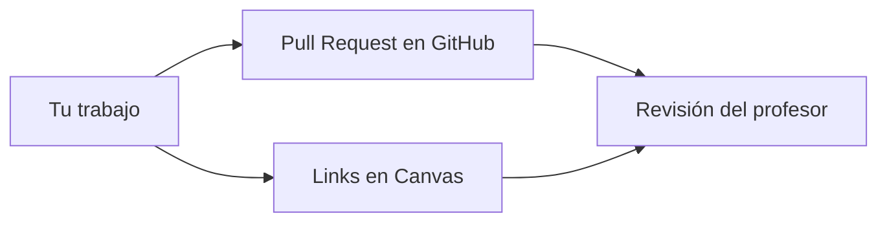

:::exam{id="6.E" title="Examen: Git y GitHub" date="2026-02-05" duration="1 hora"}

Examen en clase sobre el módulo 6 (Git y GitHub). Vale 10 puntos.

**Temas:**
- Flujo de trabajo: Sync → Branch → Work → Push → PR
- Zona Prohibida vs Zona Segura
- Comandos básicos de Git (`clone`, `add`, `commit`, `push`, `pull`)
- Fork, Clone, Upstream
- Pull Requests
- Ramas (branches)
- Git en general

:::

:::homework{id="6.3" title="Curso Intermediate GitHub Concepts" due="2026-02-05" points="20"}

Completa el curso [Intermediate GitHub Concepts](https://app.datacamp.com/learn/courses/intermediate-github-concepts).

**Entrega (igual que la tarea anterior):**
1. Pull Request con evidencia del certificado en `estudiantes/tu_usuario/certificaciones/`
2. En Canvas: Link al PR + Link a tu carpeta de evidencias

:::

:::project{id="6.P1" title="Proyecto: Página personal en GitHub Pages" due="2026-05-05" points="10"}

Crea tu propia página web y despliega en GitHub Pages. La página es libre: puede ser CV, portafolio, blog, página creativa o cualquier propuesta personal interesante.

La intención es que sea tu carta de presentación en la web: no tiene que verse como LinkedIn ni ser estrictamente profesional. Puedes mostrar lo que quieras, siempre que sea una página cuidada y con contenido propio.

**Requisitos mínimos:**
1. Repositorio en GitHub con el código fuente del sitio.
2. Sitio publicado y accesible por GitHub Pages.
3. Contenido original y coherente con tu presentación personal.
4. Demostración en clase el día de entrega (pasarán a mostrar su página).

**Entrega (Canvas):**
1. Link al repositorio en GitHub.
2. Link público al sitio desplegado en GitHub Pages.

::::

# Módulo 6: Git y GitHub

Este es el módulo más importante para la logística del curso. Aquí aprenderás cómo entregar tareas, colaborar y manejar versiones de tu código.

## Contenido (Leer en Orden)

1.  **[Instalación y SSH Keys](./01_setup_ssh.md)**
    *   Primer paso obligatorio: instalar Git y configurar las llaves de seguridad.
2.  **[Estructura del Repositorio](./02_repo_structure.md)**
    *   Entiende la "Zona Prohibida" y tu "Zona Segura".
    *   Cómo hacer Fork y Clone.
3.  **[Flujo de Trabajo (Workflow)](./03_workflow.md)**
    *   **EXAMEN:** El ciclo diario de Sync -> Branch -> Work -> Push -> PR.
    *   Todo desde la terminal, comandos manuales.
4.  **[Cheatsheet de Comandos](./04_cheatsheet.md)**
    *   Lista rápida de comandos para copiar y pegar.

### Contenido Técnico (Opcional pero Recomendado)

5.  **[Arquitectura de Git](./07_arquitectura_git.md)**
    *   Cómo funcionan los hashes SHA-1
    *   Los 3 objetos: blob, tree, commit
    *   Por qué Git es un DAG (Directed Acyclic Graph)
    *   Conceptos aplicables a blockchain, IPFS, etc.

---

## Flujo de Entrega de Tareas

**IMPORTANTE:** Todas las tareas del curso se entregan de DOS formas obligatorias:

### 1. Pull Request (PR)
- Tu código/archivos se suben mediante un Pull Request al repositorio del curso
- El PR debe seguir el flujo explicado en [03_workflow.md](./03_workflow.md)

### 2. Canvas (OBLIGATORIO)
- **Además del PR**, debes subir a la tarea correspondiente en Canvas **DOS links**:
  1. **Link al Pull Request** - URL del PR en GitHub
  2. **Link al archivo/directorio** - URL directa a tu carpeta o archivo en GitHub

**¿Por qué ambos?** Para evitar errores y facilitar la revisión. Si solo subes el PR pero no Canvas, o viceversa, la tarea se considera incompleta.

---

## 📝 Tarea Práctica: Certificaciones

Esta es tu primera entrega real. Debes configurar todo tu entorno y subir evidencias.

👉 **[Ir a las Instrucciones de la Tarea](./05_task_certifications.md)**

**Requisitos:**
*   Curso de DataCamp (GitHub Concepts) completado.
*   SSH configurado y funcionando.
*   Carpeta personal creada correctamente.
*   Pull Request enviado siguiendo el flujo oficial.
*   Links subidos a Canvas.

