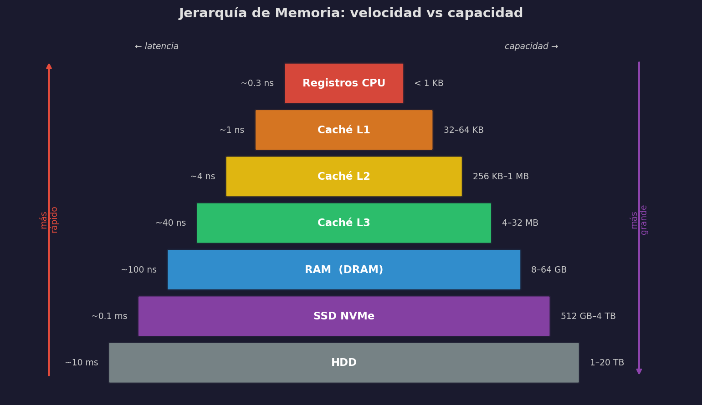

# La Máquina: Arquitectura General

Antes de hablar de velocidad, cuellos de botella o chips especializados, hay que tener un mapa de qué hay dentro de la caja.

## El modelo de Von Neumann

Toda computadora moderna sigue, en esencia, el modelo propuesto por John von Neumann en 1945: una unidad central de proceso (CPU), una memoria donde viven tanto los datos como las instrucciones, y dispositivos de entrada/salida conectados por un bus.

```
┌──────────────────────────────────────────────────────────────┐
│                         COMPUTADORA                          │
│                                                              │
│   ┌─────────────────────┐        ┌────────────────────────┐  │
│   │         CPU         │        │       Memoria (RAM)    │  │
│   │  ┌───────┐ ┌──────┐ │        │                        │  │
│   │  │  ALU  │ │  CU  │ │◄──────►│  instrucciones + datos │  │
│   │  └───────┘ └──────┘ │        │                        │  │
│   │  ┌─────────────────┐│        └────────────────────────┘  │
│   │  │    Registros    ││                 Bus del sistema     │
│   │  └─────────────────┘│◄──────────────────────────────────►│
│   └─────────────────────┘                                    │
│            ▲                      ┌────────────────────────┐  │
│            │                      │   Almacenamiento (SSD) │  │
│            ▼                      └────────────────────────┘  │
│   ┌─────────────────────┐        ┌────────────────────────┐  │
│   │       Caché         │        │   Entrada / Salida     │  │
│   │    L1 → L2 → L3     │        │   (teclado, red, GPU)  │  │
│   └─────────────────────┘        └────────────────────────┘  │
└──────────────────────────────────────────────────────────────┘
```

- **ALU** (Arithmetic Logic Unit): ejecuta sumas, multiplicaciones, comparaciones.
- **CU** (Control Unit): decodifica instrucciones y orquesta el flujo.
- **Registros**: la memoria más rápida que existe — unos pocos bytes a picosegundos de distancia.
- **Caché**: memoria intermedia entre los registros y la RAM. Invisible al programador pero crítica para el rendimiento.

El ciclo fundamental de la CPU es siempre el mismo:

```
FETCH → DECODE → EXECUTE → WRITEBACK → (repetir)
```

Cada instrucción pasa por estas etapas. Los procesadores modernos hacen esto en paralelo para varias instrucciones a la vez (pipelining), pero el modelo conceptual sigue siendo este ciclo.

---

## La jerarquía de memoria

Este es el concepto más importante del módulo. La memoria no es una sola cosa: es una jerarquía de capas donde **velocidad y capacidad siempre se oponen**.



Cada nivel es más lento y más grande que el anterior. Las latencias típicas en una máquina moderna:

| Nivel | Latencia | Capacidad típica | Costo |
|-------|----------|-----------------|-------|
| Registro | 0.3 ns | < 1 KB | muy alto |
| Caché L1 | 1 ns | 32–64 KB | alto |
| Caché L2 | 4 ns | 256 KB–1 MB | moderado |
| Caché L3 | 40 ns | 4–32 MB | moderado |
| RAM (DRAM) | 100 ns | 8–64 GB | bajo |
| SSD NVMe | 0.1 ms | 512 GB–4 TB | muy bajo |
| HDD | 10 ms | 1–20 TB | mínimo |

Para hacer concretas estas diferencias: si un acceso a registro tomara **1 segundo**, acceder a RAM equivaldría a esperar **6 minutos**; leer de un SSD serían **4 días**; y un HDD, **casi un año**.

### Por qué importa esto para data science

Cuando NumPy opera sobre un array grande, el cuello de botella rara vez es la velocidad del procesador: es el tiempo de mover datos desde RAM hasta los registros donde vive el cómputo real. Los algoritmos que acceden a datos en orden secuencial (cache-friendly) son sustancialmente más rápidos que los que saltan por la memoria de forma aleatoria, aunque hagan el mismo número de operaciones aritméticas.

---

## GPU, CPU y VRAM: cómo se conectan

En una computadora con tarjeta gráfica dedicada, la GPU no es simplemente "otro procesador más rápido". Es un subsistema con su propia memoria (VRAM), su propio ancho de banda interno, y una conexión al resto del sistema que tiene límites duros.

```
┌─────────────────────────────────────────────────────────────────────┐
│                              SISTEMA                                │
│                                                                     │
│   ┌──────────────┐   Bus PCIe x16        ┌───────────────────────┐ │
│   │     CPU      │   ~16–32 GB/s         │         GPU           │ │
│   │  ┌────────┐  │◄─────────────────────►│  ┌─────────────────┐  │ │
│   │  │ Cores  │  │   (cuello de botella) │  │  CUDA Cores     │  │ │
│   │  └────────┘  │                       │  │  (miles de      │  │ │
│   │  ┌────────┐  │                       │  │   núcleos       │  │ │
│   │  │ Caché  │  │                       │  │   simples)      │  │ │
│   │  └────────┘  │                       │  └─────────────────┘  │ │
│   └──────┬───────┘                       │  ┌─────────────────┐  │ │
│          │                               │  │  VRAM (HBM)     │  │ │
│   ┌──────┴───────┐                       │  │  24–80 GB       │  │ │
│   │   RAM (DDR5) │                       │  │  ~3,000 GB/s    │  │ │
│   │   32–64 GB   │                       │  │  (interno)      │  │ │
│   │  ~100 GB/s   │                       │  └─────────────────┘  │ │
│   └──────────────┘                       └───────────────────────┘ │
│                                                                     │
│   ← CPU tiene acceso rápido a RAM                                  │
│   ← GPU tiene acceso ultrarrápido a VRAM                           │
│   ← transferir datos entre RAM y VRAM cruzando PCIe es lento       │
└─────────────────────────────────────────────────────────────────────┘
```

El bus PCIe (Peripheral Component Interconnect Express) conecta la CPU con la GPU. En una tarjeta de alta gama, este bus transfiere datos a ~16–32 GB/s. Parece rápido, hasta que lo comparas con los ~3,000 GB/s que la GPU puede mover internamente dentro de su VRAM.

Esto explica uno de los patrones más importantes en código de machine learning:

```python
# MAL: mover datos entre CPU y GPU repetidamente dentro del loop
for batch in dataloader:
    x = batch.to("cuda")       # copia por PCIe en cada iteración
    resultado = modelo(x)
    resultado = resultado.cpu() # copia de vuelta por PCIe

# BIEN: mover una vez, operar muchas veces
datos = dataset.to("cuda")     # una sola copia al inicio
for batch in datos:
    resultado = modelo(batch)  # todo ocurre dentro de la GPU
```

La regla práctica: **mueve los datos a la GPU una sola vez, no en cada iteración**.

---

## El ciclo de instrucción

Para entender por qué ciertos patrones de código son más rápidos, ayuda saber qué hace la CPU con cada instrucción:

```
┌─────────────────────────────────────────────────────────┐
│                  Ciclo de instrucción                   │
│                                                         │
│  1. FETCH      Lee la siguiente instrucción de caché    │
│  2. DECODE     La traduce a señales eléctricas          │
│  3. EXECUTE    La ALU la ejecuta                        │
│  4. WRITEBACK  Guarda el resultado en registros/RAM     │
│                                                         │
│  → Este ciclo ocurre miles de millones de veces/segundo │
└─────────────────────────────────────────────────────────┘
```

Los procesadores modernos hacen **pipelining**: mientras una instrucción está en EXECUTE, la siguiente ya está en DECODE, y la posterior en FETCH. Esto multiplica el throughput sin aumentar la frecuencia del reloj.

El precio de este diseño: si el resultado de una instrucción determina qué instrucción viene después (dependencia de datos o salto condicional), el pipeline tiene que esperar o adivinar. Los procesadores modernos usan **predicción de saltos** para adivinar con alta precisión, pero el costo cuando fallan es visible.

:::exercise{title="Mapa mental de la máquina" difficulty="1"}
Sin mirar el diagrama, dibuja en papel:
1. El modelo de Von Neumann con sus componentes principales.
2. La jerarquía de memoria con latencias aproximadas.
3. La conexión GPU↔CPU con el cuello de botella en PCIe.

Compara con los diagramas del módulo. ¿Qué olvidaste? ¿Qué confundiste?
:::
