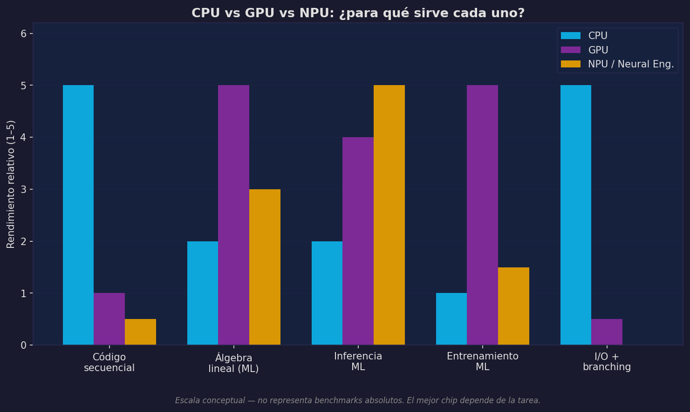

# Los Procesadores: CPU, GPU y NPU

Hay tres tipos de procesadores que dominan el cómputo moderno de datos e IA. Cada uno tiene una filosofía de diseño diferente, y entender esa filosofía explica cuándo usar cada uno.

---

## CPU: el experto en lógica compleja

La CPU está diseñada para hacer **una cosa muy difícil a la vez, muy rápido**.

Un procesador moderno de escritorio tiene entre 8 y 24 núcleos físicos, cada uno capaz de ejecutar instrucciones complejas, manejar ramificaciones condicionales arbitrarias, acceder a cualquier dirección de memoria en cualquier orden, y mantener estado interno sofisticado.

Lo que hace a la CPU especialmente buena en código general:

- **Caché grande y jerárquica**: diseñada para explotar patrones de acceso en código con mucha lógica y estructuras de datos complejas.
- **Predicción de saltos**: el procesador "adivina" qué rama tomará un `if` basándose en historia reciente. Acierta el 95%+ de las veces en código típico.
- **Ejecución fuera de orden**: reordena instrucciones para ejecutarlas en paralelo sin alterar el resultado.
- **Núcleos potentes pero pocos**: ideal para tareas donde cada unidad de trabajo es compleja y depende de los resultados anteriores.

La CPU domina cuando el código tiene:

- Mucha lógica condicional (`if/elif/else`)
- Acceso a estructuras de datos irregulares (grafos, árboles, diccionarios)
- Operaciones que dependen fuertemente de resultados anteriores
- I/O: leer archivos, hacer requests, esperar respuestas de red

---

## GPU: fuerza bruta en paralelo

La GPU está diseñada para hacer **millones de cosas simples al mismo tiempo**.

Una GPU moderna (H100) tiene ~16,896 núcleos CUDA. Cada uno es mucho más simple que un núcleo de CPU: no tiene predicción de saltos sofisticada, no ejecuta fuera de orden, y su caché es pequeña. Pero son miles operando en paralelo sobre los mismos datos.

La unidad fundamental de organización en una GPU no es el núcleo individual sino el **Streaming Multiprocessor (SM)**: un bloque de decenas o cientos de núcleos que ejecutan la misma instrucción sobre datos diferentes al mismo tiempo (SIMT — Single Instruction, Multiple Threads).

```
CPU (16 cores)                GPU (16,000+ cores)
──────────────────────        ──────────────────────────────
┌──┐┌──┐┌──┐┌──┐              ┌─┐┌─┐┌─┐┌─┐┌─┐┌─┐┌─┐┌─┐┌─┐
│  ││  ││  ││  │  ← pocos     │ ││ ││ ││ ││ ││ ││ ││ ││ │
│  ││  ││  ││  │    complejos │ ││ ││ ││ ││ ││ ││ ││ ││ │
└──┘└──┘└──┘└──┘              └─┘└─┘└─┘└─┘└─┘└─┘└─┘└─┘└─┘
                               ... (miles más) ...
Cada core: poderoso            Cada core: simple
Branching: sí                  Branching: costoso
Caché: grande                  Caché: pequeña
Lógica irregular: sí           Misma op en muchos datos: sí
```

La GPU brilla cuando el trabajo puede expresarse como "aplica esta operación a cada elemento de este array de un millón de entradas". Exactamente lo que ocurre en multiplicación de matrices, convoluciones y la mayoría de operaciones de redes neuronales.

### El ancho de banda como ventaja clave

Más allá de los núcleos, la VRAM de una GPU moderna usa memoria HBM (High Bandwidth Memory), diseñada para mover datos a velocidades que la RAM convencional no puede igualar:

```
RAM del sistema (DDR5):    ~100 GB/s
VRAM RTX 4090 (GDDR6X):   ~1,000 GB/s
VRAM H100 SXM5 (HBM3e):   ~3,350 GB/s
```

Cuando el cómputo es una multiplicación de matrices enorme, el cuello de botella no es el tiempo de cómputo sino el tiempo de mover los datos hacia y desde donde operan los núcleos. La VRAM HBM elimina ese cuello de botella.

---

## NPU: silicio de propósito específico

El NPU (Neural Processing Unit) toma una filosofía completamente diferente: en lugar de ser flexible, **hace exactamente una clase de operaciones, de forma extremadamente eficiente**.

Los NPUs están optimizados para:

- Multiplicaciones de matrices en baja precisión (INT8, INT4)
- Convoluciones
- Operaciones de activación

No pueden reemplazar a la CPU para lógica general. No pueden reemplazar a la GPU para entrenamiento (que requiere gradientes en FP32/BF16). Pero para **inferencia** (correr un modelo ya entrenado para hacer predicciones), pueden ser más eficientes en términos de operaciones por vatio que una GPU.

Ejemplos:

| NPU | Dispositivo | Caso de uso |
|-----|-------------|-------------|
| Apple Neural Engine | M3 / A17 | Inferencia local en Mac / iPhone |
| Qualcomm Hexagon | Snapdragon | IA en dispositivos Android |
| Google TPU | Cloud / Pixel | Entrenamiento e inferencia |
| Intel NPU | Core Ultra | IA en laptops Windows |

La intuición: un NPU es como una fábrica construida para producir solo un artículo. No es flexible, pero dentro de ese artículo es imbatible en eficiencia energética.

---

## La comparación



El gráfico muestra rendimiento relativo conceptual, no benchmarks absolutos. El mensaje importante:

- **CPU**: gana en código secuencial con lógica compleja y en I/O.
- **GPU**: gana en álgebra lineal masivamente paralela y en entrenamiento de ML.
- **NPU**: gana en inferencia, especialmente con modelos cuantizados.

Ninguno es universalmente superior. La elección depende de la tarea.

---

## ARM vs x86: la guerra de las arquitecturas

Hay dos familias de arquitecturas que dominan el mercado, y su diferencia es filosófica:

**x86 (CISC — Complex Instruction Set Computing)**

Intel y AMD. La arquitectura dominante en servidores y PCs desde los años 80. Diseñada históricamente para hacer mucho trabajo en pocas instrucciones: una sola instrucción puede hacer una operación compleja como leer de memoria, sumar, y escribir de vuelta. El hardware es más complejo, consume más energía, pero la compatibilidad hacia atrás con décadas de software es su gran ventaja.

**ARM (RISC — Reduced Instruction Set Computing)**

Qualcomm, Apple, Amazon (Graviton). Hace lo opuesto: instrucciones simples que hacen una sola cosa. Esto hace el hardware más simple, más eficiente en energía, y más fácil de fabricar a frecuencias altas. La complejidad se mueve del hardware al compilador.

La narrativa de los últimos años:

```
2020: Apple lanza M1 (ARM)
  → MacBooks con 2-3× mejor rendimiento por vatio que Intel
  → Batería que dura 18 horas
  → Serverless en AWS usa Graviton (ARM) porque es más barato
  → Android y móviles ya eran ARM hace 15 años

Hoy: ARM domina móviles y laptops; x86 domina servidores (por compatibilidad)
```

Para ciencia de datos: en la práctica, la mayoría de las librerías (NumPy, PyTorch, pandas) están compiladas para ambas arquitecturas y el impacto es transparente. La diferencia más visible es en el costo de las instancias de nube: instancias ARM (Graviton en AWS, Ampere en GCP) suelen ser 20–40% más baratas por unidad de cómputo.

---

## Cores, reloj y rendimiento

### Núcleos físicos vs lógicos

Un **núcleo físico** es un procesador real con su propia ALU, registros y caché L1/L2. Un **núcleo lógico** (o hilo, thread) es la ilusión de un segundo procesador creada por hyperthreading: el núcleo físico tiene dos conjuntos de registros, y cuando uno espera datos de memoria, el otro puede ejecutar instrucciones.

```python
import psutil
psutil.cpu_count(logical=False)  # núcleos físicos
psutil.cpu_count(logical=True)   # núcleos lógicos (= físicos × 2 con HT)
```

Para cargas computacionalmente intensas (entrenamiento de modelos, procesamiento de arrays), el número de núcleos físicos es más relevante. Para cargas con mucho I/O o que esperan respuestas externas, los núcleos lógicos sí ayudan.

### Frecuencia de reloj (GHz)

El reloj del procesador determina cuántos ciclos ocurren por segundo. A 3 GHz: 3,000,000,000 ciclos/segundo. Cada instrucción toma entre 1 y varios ciclos.

Lo que GHz **no** captura:
- Cuántas instrucciones se ejecutan por ciclo (IPC — Instructions Per Cycle)
- Cuántas operaciones puede hacer una instrucción (SIMD)
- Cuántos núcleos ejecutan en paralelo

Por eso comparar GHz entre arquitecturas distintas es engañoso. Un procesador ARM a 3 GHz puede superar a uno x86 a 4 GHz dependiendo del trabajo.

### Overclocking y límites térmicos

El overclocking consiste en forzar el procesador a funcionar a una frecuencia mayor que la especificada por el fabricante. El límite no es arbitrario: a mayor frecuencia, mayor voltaje necesario para mantener señales estables, lo que genera más calor exponencialmente. Sin disipación adecuada, el procesador se apaga por protección térmica o, en casos extremos, se daña.

En la práctica para data science: el overclocking no se usa en servidores ni en instancias de nube (demasiado calor, demasiado riesgo, beneficio marginal frente a paralelismo). Es relevante en workstations dedicadas o en contextos de gaming.

---

## Una nota sobre ensamblador

Todo código Python eventualmente se convierte en instrucciones de bajo nivel que el procesador entiende directamente. La cadena de traducción:

```
Python          →   bytecode (.pyc)   →   instrucciones nativas
a = 2 + 3           LOAD_CONST 2          mov eax, 2
                    LOAD_CONST 3          add eax, 3
                    BINARY_ADD            mov [a], eax
                    STORE_NAME a
```

Lo que importa entender (sin necesidad de escribir ensamblador):

**Instrucciones SIMD** (Single Instruction, Multiple Data): extensiones como AVX2/AVX-512 permiten que una sola instrucción opere sobre 8 o 16 valores flotantes al mismo tiempo.

```
Instrucción escalar:    ADD  r1, r2         → 1 suma
Instrucción SIMD AVX2:  VADDPS ymm0, ymm1  → 8 sumas simultáneas
```

NumPy, pandas y la mayoría de librerías científicas son compiladas para usar SIMD automáticamente. Por eso un loop de Python sobre 8 números puede ser 8 veces más lento que la operación equivalente en NumPy — no porque NumPy use un algoritmo diferente, sino porque usa instrucciones del procesador que Python puro no puede emitir.

:::exercise{title="Elegir procesador para una tarea" difficulty="2"}
Para cada tarea siguiente, decide qué procesador usarías (CPU, GPU o NPU) y explica brevemente por qué:

1. Limpiar un CSV de 10 millones de filas con pandas.
2. Entrenar una red neuronal convolucional sobre ImageNet.
3. Correr inferencia de un modelo de visión en tiempo real en un teléfono.
4. Construir un índice de búsqueda con consultas SQL complejas.
5. Fine-tuning de un LLM de 7B parámetros.
:::
