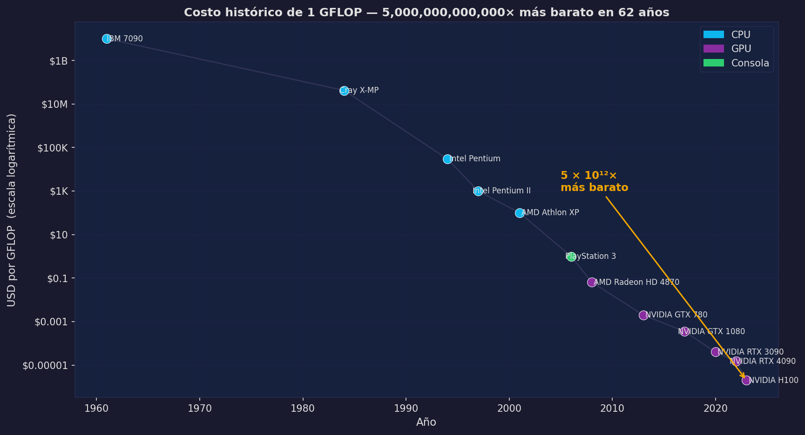
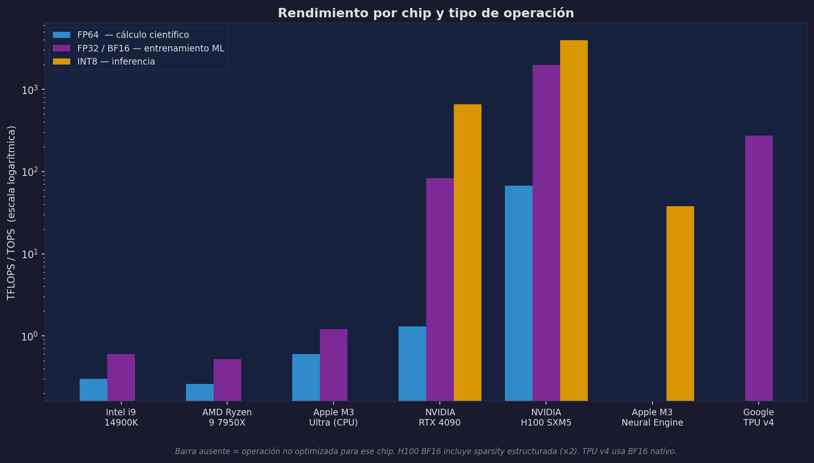
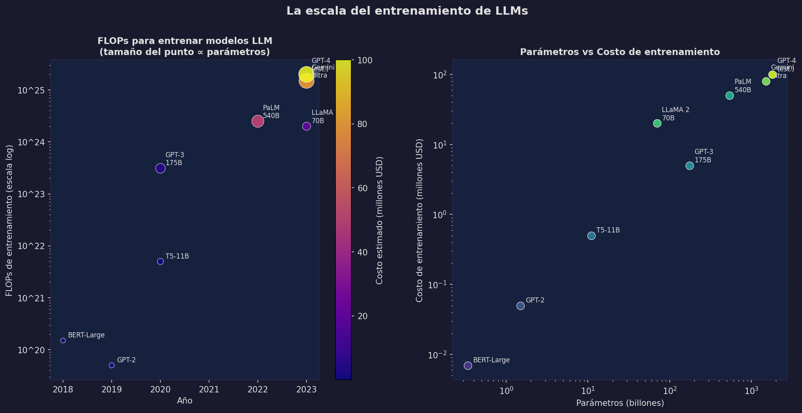

# Rendimiento y Escala

Los dos problemas que más limitan el rendimiento en cómputo científico no son la velocidad del procesador ni el número de núcleos. Son **cuántos datos puede el procesador ver por segundo** y **si la operación que queremos hacer puede ejecutarse en paralelo**. Este capítulo explica estas dos ideas y las conecta con los números reales de la IA moderna.

---

## ¿Qué es un FLOP?

**FLOP** significa *Floating Point Operation*: una operación aritmética (suma, resta, multiplicación o división) sobre números de punto flotante.

Ejemplos:

```
a + b           → 1 FLOP
a * b + c       → 2 FLOPs  (multiplicación + suma)
a * b - c * d   → 3 FLOPs  (dos multiplicaciones + una resta)
```

Los chips se miden en cuántos FLOPs pueden ejecutar por segundo:

```
MFLOPS  = millones de FLOPs/s       (10^6)   — laptops años 90
GFLOPS  = miles de millones/s       (10^9)   — CPUs modernos
TFLOPS  = billones de FLOPs/s       (10^12)  — GPUs modernas
PFLOPS  = mil billones/s            (10^15)  — supercomputadoras
EFLOPS  = millón de billones/s      (10^18)  — clusters de IA
```

---

## Por qué la multiplicación de matrices domina la IA

Una multiplicación de matrices de tamaño M×K por K×N requiere exactamente:

```
FLOPs = 2 × M × N × K
```

El factor 2 viene de que cada elemento del resultado requiere K multiplicaciones y K sumas.

Un transformer pequeño (BERT-base, 110M parámetros) ejecuta durante un forward pass por el orden de 10^10 FLOPs. Un LLM grande (GPT-4 estimado en ~1.8 billones de parámetros) ejecuta ~2×10^12 FLOPs por cada token generado.

Lo crítico: **la multiplicación de matrices es embarazosamente paralela**. No hay dependencias entre los elementos del resultado: el elemento [i,j] no necesita que [i,k] esté calculado para computarse. Esto lo hace perfectamente adecuado para la GPU.

---

## El cuello de botella de la memoria

Aquí está el truco que mucha gente no sabe: en muchas operaciones de ML, el procesador no está limitado por su velocidad de cómputo sino por qué tan rápido puede recibir datos.

El concepto clave es la **intensidad aritmética**: cuántos FLOPs se ejecutan por cada byte que se lee de memoria.

```
Intensidad aritmética = FLOPs / bytes leídos

Operación           FLOPs   Bytes (FP32)   Intensidad
──────────────────────────────────────────────────────
Suma de vector      N       4N             0.25 FLOP/byte
Multiplicación      N       8N             0.125 FLOP/byte
  elemento a elemento
MatMul N×N          2N³     N² × 4         ~N/2 FLOP/byte
  (con N grande)
```

Una multiplicación de matrices grande tiene alta intensidad aritmética: reutiliza cada número muchas veces. Por eso la GPU puede saturar sus núcleos con trabajo. Una suma de vectores tiene baja intensidad: lee un número, hace una operación, pasa al siguiente — los núcleos están casi siempre esperando datos.

```
Operación memory-bound:
  [RAM] ─────────────── (datos llegan lentamente) ──────► [ALU]
   ████                                                     □□□
  saturada                                                  ociosa

Operación compute-bound:
  [RAM] ─── (datos llegan bien) ──► [ALU] ─── (trabaja todo el tiempo)
   □□□                               ████
   ociosa                            saturada
```

Esto explica por qué no todas las operaciones en GPU son rápidas. Operaciones como softmax, layer norm o ciertas funciones de activación son memory-bound: aunque la GPU tenga miles de núcleos, está limitada por qué tan rápido puede leer los activaciones de la capa anterior.

---

## Vectorización: 8 operaciones en 1 instrucción

Las CPUs modernas incluyen **extensiones SIMD** (Single Instruction, Multiple Data): instrucciones que operan sobre múltiples valores en un solo ciclo.

```
Sin SIMD (escalar):
  LOOP: ADD r0, r0[0] + r1[0]
        ADD r0, r0[1] + r1[1]
        ADD r0, r0[2] + r1[2]
        ADD r0, r0[3] + r1[3]
        ... (8 instrucciones)

Con SIMD AVX2 (256 bits):
  VADDPS ymm0, ymm0, ymm1   ← suma 8 floats de 32 bits en 1 instrucción
```

NumPy, pandas, PyTorch y SciPy aprovechan SIMD automáticamente porque están compiladas con soporte para estas instrucciones. Un loop de Python sobre arrays no puede usarlas.

```python
# Esto NO usa SIMD:
result = [a[i] + b[i] for i in range(1_000_000)]

# Esto SÍ usa SIMD (internamente, sin que lo veas):
result = a + b  # NumPy: VADDPS bajo el capó
```

El speedup no es solo por evitar overhead de Python. Hay una diferencia de hardware real.

---

## FLOPs histórico: la caída más grande de la historia

El costo de ejecutar un GFLOP de cómputo ha caído de manera que supera cualquier otra tecnología conocida.



En 1961, ejecutar un gigaFLOP costaba el equivalente a **10,000 millones de dólares**. En 2023, costaba **0.000002 dólares**. Una reducción de **cinco billones de veces** en 62 años.

Para dar contexto: la Ley de Moore (transistores por chip se duplican cada ~2 años) predice 2^31 ≈ 2 mil millones de veces en 62 años. El costo de cómputo cayó incluso más rápido que eso, impulsado también por mejoras de arquitectura, fabricación y la transición de CPUs a GPUs para cómputo paralelo.

**El punto de inflexión visible en la gráfica**: alrededor de 2006–2008, cuando las GPUs se empezaron a usar para cómputo general (CUDA se lanzó en 2007), el costo por FLOP aceleró su caída. La PlayStation 3 de Sony (2006) fue uno de los primeros dispositivos de consumo masivo que democratizó acceso a ~1 TFLOP por ~$400.

---

## Chips actuales por tipo de operación

No todos los FLOPs son iguales. La **precisión numérica** determina cuántos bits usa cada número:

- **FP64** (64 bits): máxima precisión. Necesario para simulaciones científicas, física, finanzas de alta precisión.
- **FP32** (32 bits): el estándar de entrenamiento de redes neuronales. Suficiente para gradientes.
- **BF16** (16 bits, brain float): usado masivamente en LLMs. Mismo rango que FP32, menos precisión.
- **INT8** (8 bits entero): inferencia cuantizada. Suficiente para producción en muchos modelos.



Lo que muestra la gráfica en escala logarítmica:

- CPUs (i9, Ryzen, M3): tienen FP64 y FP32 razonables, pero sin INT8 optimizado.
- RTX 4090: FP64 moderado (1.3 TFLOPS), FP32 enorme (82.6 TFLOPS), INT8 masivo (660 TOPS).
- H100: FP64 de clase científica (67 TFLOPS), BF16 con sparsity (1979 TFLOPS), INT8 (3958 TOPS).
- Apple Neural Engine: solo INT8 (~38 TOPS) — no sirve para entrenar, pero es altamente eficiente para inferir.
- TPU v4: diseñado para BF16, especialmente eficiente en ese dominio.

La lección: **el chip correcto para inferencia no es el mismo que para entrenamiento**, y el chip correcto para entrenamiento no es el mismo que para simulación científica.

---

## La escala del entrenamiento de LLMs



Los dos paneles del gráfico cuentan la misma historia desde ángulos distintos:

**Panel izquierdo**: los FLOPs de entrenamiento crecen múltiples órdenes de magnitud año a año. El tamaño del punto es proporcional al número de parámetros. El color representa el costo estimado.

**Panel derecho**: la relación entre parámetros y costo de entrenamiento es aproximadamente lineal en escala log-log, lo que indica una relación de potencia — duplicar parámetros más que duplica el costo.

Algunos números concretos:

| Modelo | Año | FLOPs de entrenamiento | Costo estimado |
|--------|-----|----------------------|----------------|
| GPT-2 | 2019 | ~5 × 10^19 | ~$50K |
| GPT-3 175B | 2020 | ~3.1 × 10^23 | ~$5M |
| LLaMA 2 70B | 2023 | ~2 × 10^24 | ~$20M |
| GPT-4 (est.) | 2023 | ~2 × 10^25 | ~$100M+ |

La fórmula de Chinchilla (2022) demostró que la práctica anterior de escalar solo parámetros era subóptima: un modelo óptimo necesita aproximadamente **20 tokens de entrenamiento por parámetro**. Esto implica que un modelo de 70B parámetros necesita ~1.4 billones de tokens, y el cómputo crece con el producto de ambos.

### ¿Cuánto tiempo tarda en práctica?

GPT-3 se entrenó en ~1,000 GPUs A100 durante varias semanas. Cada A100 ejecuta ~312 TFLOPS en BF16. Entonces:

```
Cómputo disponible: 1,000 GPUs × 312 TFLOPS × 0.3 (eficiencia real) ≈ 93.6 PFLOPS

FLOPs necesarios: 3.1 × 10^23
Tiempo: 3.1 × 10^23 / (9.36 × 10^16 FLOPS/s) ≈ 3.3 × 10^6 segundos ≈ 38 días
```

Esta es una estimación aproximada que coincide con los ~4–6 semanas reportados públicamente.

---

## Síntesis: cinco reglas para ML/data science

1. **El cuello de botella suele ser la memoria, no el cómputo.** Antes de comprar más FLOPs, verifica si tus operaciones son memory-bound.

2. **Usa el tipo de precisión correcto.** FP32 para entrenar, INT8 para inferir, FP64 solo cuando necesitas esa precisión matemática.

3. **La GPU solo tiene sentido si el trabajo es paralelizable.** Código con mucho `if/elif`, grafos o estructuras irregulares puede correr más lento en GPU que en CPU.

4. **El transferir datos entre CPU y GPU tiene costo real.** Mueve datos una sola vez. Batching existe también por esto.

5. **La escala importa.** Entrenar un LLM desde cero requiere infraestructura de cientos de millones de dólares. Fine-tuning de un modelo ya entrenado cuesta miles. Inferencia de un modelo pequeño puede correr en una laptop. Elegir en qué punto de ese espectro operar es una decisión de ingeniería, no solo de ciencia.

:::exercise{title="Estimación de Fermi — costo de entrenamiento" difficulty="3"}
Estima el costo de entrenar un modelo de 7 billones de parámetros con 1 billón de tokens de entrenamiento:

1. Usando la fórmula `FLOPs ≈ 6 × parámetros × tokens`, calcula los FLOPs totales.
2. Asume una GPU H100 con 1,000 TFLOPS de rendimiento efectivo en BF16.
3. Asume que rentas H100s a $3/hora por GPU.
4. ¿Cuántas GPU-horas necesitas? ¿Cuánto cuesta?
5. ¿Cuántas GPUs necesitarías para terminar en 1 semana?

Compara tu estimación con los costos públicamente reportados para modelos similares (LLaMA 2 7B).
:::
