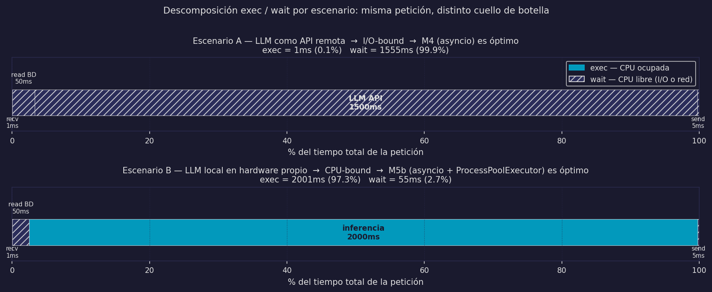

# Cómputo: Secuencial, Concurrente, Paralelo y Distribuido

Este módulo introduce formal y sistemáticamente los modelos de ejecución que subyacen a todo el cómputo moderno. Antes de construir sistemas reales necesitamos entender con precisión qué significa que un programa sea *concurrente*, *asíncrono*, *paralelo* o *distribuido* — y sobre todo, las diferencias entre ellos.

## El dominio que usaremos: un chatbot

A lo largo del módulo construimos la misma aplicación — un chatbot — en cuatro versiones evolutivas. Cada versión resuelve las limitaciones de la anterior y motiva el siguiente modelo de ejecución.

Pero antes de ver las versiones, necesitamos entender algo fundamental: **¿dónde pasa el tiempo en una petición al chatbot?** La respuesta depende de cómo está implementado el LLM:

```
┌────────────────────────────────────────────────────────────────────┐
│  Escenario A — LLM como API remota (OpenAI, Anthropic, Gemini…)   │
│                                                                    │
│  recv(1ms) → leer BD(50ms) → llamar API LLM(1500ms) → send(5ms)  │
│                                                                    │
│  ≈ 99.8% del tiempo es wait  →  I/O-bound  →  M4 es óptimo       │
└────────────────────────────────────────────────────────────────────┘

┌────────────────────────────────────────────────────────────────────┐
│  Escenario B — LLM local en hardware propio (llama.cpp, ollama…)  │
│                                                                    │
│  recv(1ms) → leer BD(50ms) → inferencia CPU(2000ms) → send(5ms)  │
│                                                                    │
│  ≈ 97% del tiempo es exec  →  CPU-bound  →  M5b es óptimo        │
└────────────────────────────────────────────────────────────────────┘
```



## La historia que seguiremos

```
Chatbot v1 — Secuencial
  Un usuario a la vez. El décimo usuario espera 9 veces el tiempo de respuesta.
  ↓ problema: CPU ociosa durante I/O, latencia inaceptable con múltiples usuarios

Chatbot v2 — Concurrente + Asíncrono (asyncio)  [Escenario A]
  100 usuarios simultáneos. El servidor explota las esperas de API para atender a otros.
  ↓ pregunta: ¿y si el LLM es local? la inferencia bloquea todo

Chatbot v3 — Paralelo + Asíncrono (asyncio + ProcessPoolExecutor)  [Escenario B]
  Inferencia en procesos paralelos, I/O gestionada por asyncio. Speedup real.
  ↓ límite: una sola máquina tiene P cores finitos (Ley de Amdahl)

Chatbot v4 — Distribuido (conceptual)
  Múltiples servidores, balanceador de carga, sin memoria compartida entre nodos.
```

## Los 6 modelos de ejecución

```
                    ASYNC (esperas explotadas)
                    NO                  SÍ
               ┌────────────────┬────────────────────┐
  SECUENCIAL   │  M1            │  M2                │
  (sin overlap │  Secuencial    │  Async no          │
   de tareas)  │  clásico       │  concurrent        │
               ├────────────────┼────────────────────┤
  CONCURRENTE  │  M3            │  M4  ← Escenario A │
  (overlap,    │  Concurrent    │  Concurrent        │
   P=1)        │  no async      │  + async (asyncio) │
               ├────────────────┼────────────────────┤
  PARALELO     │  M5a           │  M5b ← Escenario B │
  (simultáneo, │  Parallel      │  Parallel          │
   P≥2)        │  CPU-bound     │  + async (mixto)   │
               └────────────────┴────────────────────┘

  M6: Distribuido — corta transversalmente (múltiples máquinas)

  Jerarquía: Distribuido ⊇ Paralelo ⊇ Concurrente
             Asíncrono es ortogonal (independiente)
```

## Estructura del módulo

| Clase | Archivos | Notebook |
|-------|----------|----------|
| **Clase 1** | `01_procesos_y_hilos.md` — proceso, hilo, GIL, I/O vs CPU, escenarios A y B | `code/01_procesos_hilos.ipynb` |
| | `02_secuencial.md` — framework matemático + M1 + chatbot v1 | |
| **Clase 2** | `03_concurrencia_y_asincronia.md` — M2, M3, M4 formales | `code/02_concurrencia_asyncio.ipynb` |
| | `04a_asyncio_fundamentos.md` — event loop, async/await, gather, chatbot v2 | |
| **Clase 3** | `04b_asyncio_patrones.md` — create_task, Queue, anti-patrones | `code/03_paralelismo_benchmarks.ipynb` |
| | `05_paralelismo.md` — M5, Amdahl, chatbot v3 (Escenario B) | |
| | `06_librerias_y_decision.md` — pools, librerías, árbol de decisión | |
| | `07_distribuido_intro.md` — M6 conceptual + síntesis final | |

## Prerrequisitos

Este módulo asume conocimiento de Python (módulos 09–14). No se requiere conocimiento previo de sistemas operativos ni redes.
