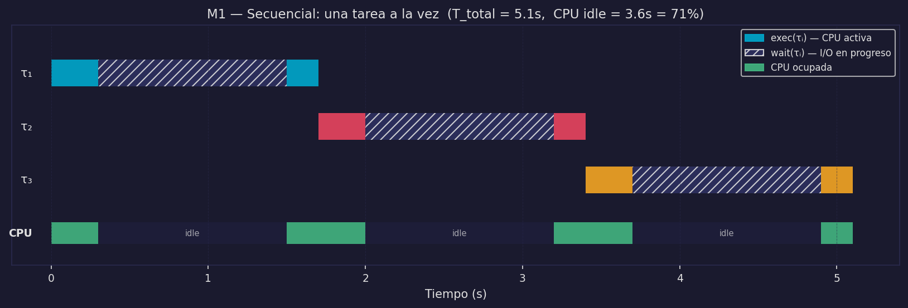

# El Framework Matemático y el Modelo Secuencial

Este archivo define el **framework matemático completo** que usaremos en todo el módulo. Los objetos definidos aquí — T, τᵢ, exec, wait, ExecutingAt, P — aparecerán en todos los modelos siguientes sin redefinirse.

---

## Framework matemático: definiciones base

### Tiempo

*En la cocina:* la línea de tiempo del día de trabajo en el restaurante — desde que abre hasta que cierra.

```
T = ℝ⁺ ∪ {0}    conjunto de todos los instantes de tiempo
```

### Tarea

*En la cocina:* el conjunto de tickets de órdenes que hay que procesar hoy.

```
Task = {τ₁, τ₂, ..., τₙ}    conjunto de tareas a ejecutar
τᵢ ∈ Task                    una tarea individual
```

Cada tarea tiene límites temporales:

*En la cocina:* desde que llega el ticket hasta que se entrega el plato.

```
start(τᵢ) ∈ T    instante en que la tarea comienza
end(τᵢ) ∈ T      instante en que la tarea termina
start(τᵢ) ≤ end(τᵢ)
```

### Ejecución CPU

*En la cocina:* los momentos en que el cocinero trabaja activamente en esta orden — corta, mezcla, emplata. El cocinero está presente y en movimiento.

```
exec(τᵢ) ⊆ T    conjunto de instantes en que la CPU ejecuta τᵢ
```

### Espera I/O

*En la cocina:* los momentos en que la orden está en el horno, cafetera o timer — el dispositivo trabaja solo. El cocinero no necesita estar presente; podría hacer otra cosa.

```
wait(τᵢ) ⊆ T    conjunto de instantes en que τᵢ espera un dispositivo externo
```

### Restricción fundamental

*En la cocina:* una orden no puede estar siendo procesada activamente por el cocinero **y** en el horno al mismo tiempo. O el cocinero trabaja en ella, o está en el horno — no ambas.

```
exec(τᵢ) ∩ wait(τᵢ) = ∅
```

Esta restricción vale para **todos** los modelos sin excepción.

### Enlace con I/O-bound / CPU-bound

Como se estableció en `01_procesos_y_hilos.md`:
```
CPU-bound  ≡  wait(τᵢ) = ∅     toda la tarea es exec, nunca espera I/O
I/O-bound  ≡  wait(τᵢ) ≠ ∅     la tarea tiene al menos un instante de espera
```

### Tareas ejecutando en t

*En la cocina:* qué órdenes está procesando activamente el cocinero en este instante preciso.

```
ExecutingAt(t) = {τᵢ ∈ Task | t ∈ exec(τᵢ)}
```

### Cores físicos

*En la cocina:* cuántos fogones tiene la cocina. No pueden usarse más fogones de los que existen.

```
P = número de cores físicos disponibles

|ExecutingAt(t)| ≤ P    para todo t ∈ T
```

---

## Modelo 1: Secuencial (M1)

### En la cocina

El cocinero toma una orden, la procesa **completamente de principio a fin**, y **solo entonces** toma la siguiente. No hay nada en el horno mientras trabaja en otra orden. Si llegan 10 clientes, el décimo espera que los 9 anteriores sean atendidos completamente antes de recibir cualquier atención.

### En lenguaje natural

Una tarea no comienza hasta que la anterior ha terminado por completo. Los ciclos de vida de cualquier par de tareas no se solapan en absoluto — hay un orden total y estricto.

### Formalmente

```
M1 — Secuencial:
∀ τᵢ, τⱼ ∈ Task, i ≠ j:
    end(τᵢ) ≤ start(τⱼ)  ∨  end(τⱼ) ≤ start(τᵢ)
```

Propiedades que se derivan:
```
|ExecutingAt(t)| ≤ 1          siempre hay a lo mucho una tarea en CPU
exec(τⱼ) ∩ wait(τᵢ) = ∅      para todo i ≠ j  (esperas no explotadas)
T_total = Σᵢ (end(τᵢ) - start(τᵢ))
```

La segunda propiedad es la limitación crítica: **si τᵢ tiene wait(τᵢ) ≠ ∅, la CPU queda ociosa durante esos instantes**. Nadie más la usa.

### Diagrama de Gantt



El diagrama muestra: mientras τᵢ espera I/O, la fila CPU queda vacía. Esos ciclos se desperdician.

### Pseudocódigo

```python
for τᵢ in tareas:
    resultado = procesar(τᵢ)   # bloqueante: espera hasta terminar
    guardar(resultado)
# τᵢ₊₁ no empieza hasta que τᵢ termina completamente
```

---

## Chatbot v1: servidor secuencial

### En la cocina

La estación de cocina recibe pedidos en una cola. El cocinero atiende el primero, lo procesa desde que llega el ticket hasta que sale el plato, y **solo entonces** toma el siguiente ticket. La cola crece mientras el cocinero está ocupado.

```
Cola de peticiones:
[τ_u1] ──▶ [τ_u2] ──▶ [τ_u3] ──▶ ... ──▶ [τ_u10]

         ┌──────────────────────────────────┐
τ_u1 ──▶ │  Servidor (1 proceso, 1 hilo)   │
         │                                  │
         │  recv → leer_BD → LLM → send     │
         │                                  │
         │  τ_u2...τ_u10 esperan aquí  ⟵   │
         └──────────────────────────────────┘
               │            │
               ▼            ▼
          [ Base de     [ LLM API ]
            datos ]     (espera red)
```

### Formalmente

```
Task = {τ_u1, τ_u2, ..., τ_u10}
end(τ_u1) ≤ start(τ_u2) ≤ end(τ_u2) ≤ start(τ_u3) ...

Con T_petición = 1.56s (Escenario A):
    Latencia(τ_u1)  =  1.56s
    Latencia(τ_u2)  =  3.12s   (espera τ_u1 + 1.56s)
    Latencia(τ_u10) = 15.6s    ← inaceptable
    T_total = 15.6s
```

Durante cada `leer_BD()` y `llamar_LLM()`, la CPU está completamente ociosa (99.94% del tiempo en Escenario A). El servidor está bloqueado esperando, sin poder atender a nadie más.

### Pseudocódigo

```python
# Servidor chatbot v1 — secuencial
def servidor():
    while True:
        peticion  = esperar_peticion()   # wait — I/O (red)
        historial = leer_bd(peticion)    # wait — I/O (BD)
        respuesta = llamar_llm(historial) # wait — I/O (API) o exec — CPU (local)
        enviar(respuesta)                # wait — I/O (red)
        # La siguiente petición no se toma hasta aquí ← el problema
```

### Diagrama del chatbot v1

```
t=0.0   recv  τ_u1 ──────────────────────────────────────────────▶ t=1.56
        │ 1ms │       50ms        │         1500ms        │  5ms │
        │exec │  wait (BD)        │     wait (LLM API)    │ wait │
                                                                  │
t=1.56  recv  τ_u2 ──────────────────────────────────────────────▶ t=3.12
        │ 1ms │       50ms        │         1500ms        │  5ms │
        ...
t=14.04 recv τ_u10 ─────────────────────────────────────────────▶ t=15.60
```

El modelo M1 establece el **baseline** contra el cual mediremos la mejora de todos los modelos siguientes.

---

:::exercise{title="Análisis del modelo secuencial"}
Dado un servidor con τ = {τ₁, τ₂, τ₃} donde:
- τ₁: exec = [0, 0.5], wait = [0.5, 2.0], exec = [2.0, 2.2]
- τ₂: exec = [2.2, 3.0] (CPU-bound, sin wait)
- τ₃: exec = [3.0, 3.2], wait = [3.2, 5.5], exec = [5.5, 5.7]

Calcula: T_total, el porcentaje de tiempo que la CPU está ociosa, y Latencia(τ₃).

¿Cómo cambian estos números en el Escenario B (LLM local, τ₁ y τ₃ son CPU-bound en lugar de I/O-bound)?
:::
