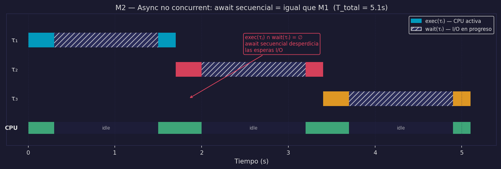
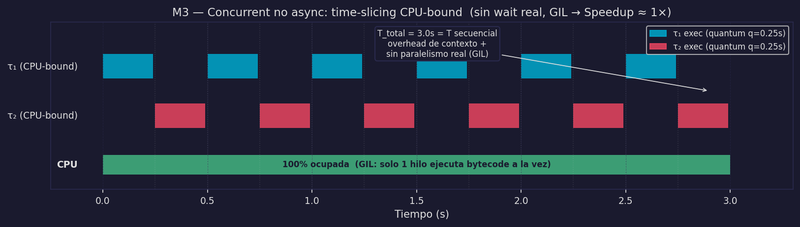
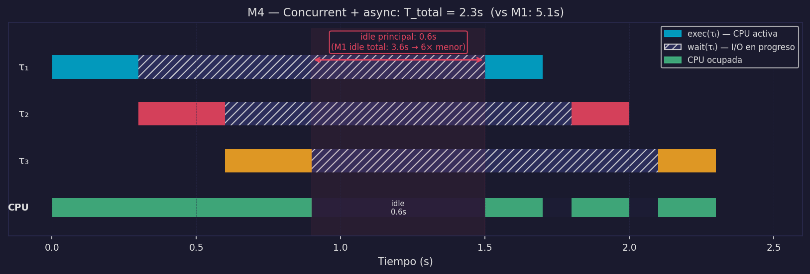

# Concurrencia, Asincronía y los Modelos M2–M4

En `02_secuencial.md` establecimos el framework matemático completo y vimos M1. Ahora definimos dos propiedades nuevas — **concurrencia** y **asincronía** — y construimos los tres modelos que resultan de combinarlas. Son propiedades ortogonales: una puede existir sin la otra.

---

## Definiciones formales

Usamos el framework de `02_secuencial.md`: T, τᵢ, exec, wait, ExecutingAt, P.

### Concurrencia

*En la cocina:* el cocinero tiene más de un ticket activo al mismo tiempo — hay dos órdenes "en progreso" aunque no las trabaje físicamente de forma simultánea. Los ciclos de vida se solapan.

```
Concurrencia:
∃ τᵢ, τⱼ ∈ Task, i ≠ j:
    [start(τᵢ), end(τᵢ)] ∩ [start(τⱼ), end(τⱼ)] ≠ ∅
```

Los ciclos de vida de al menos dos tareas se solapan. τⱼ empieza antes de que τᵢ termine.

> **Concurrencia ≠ Paralelismo.** Concurrencia es solapamiento de ciclos de vida — puede ocurrir con P=1 mediante time-slicing. Paralelismo es ejecución física simultánea — requiere P≥2. La relación formal (Paralelo ⊃ Concurrente) se demuestra en `05_paralelismo.md`.

### Tarea async-capable (I/O-bound)

*En la cocina:* una orden que pasa por el horno. El cocinero **podría** alejarse mientras espera — pero no tiene por qué hacerlo.

```
Tarea async-capable:  wait(τᵢ) ≠ ∅
```

Idéntico a "I/O-bound" de `01_procesos_y_hilos.md`. La denominación "async-capable" enfatiza la **capacidad** de liberar la CPU durante sus esperas — si el sistema decide explotarla.

### Sistema asíncrono (explotación de esperas)

*En la cocina:* el cocinero, al poner una orden en el horno, **consulta su lista de pendientes** y toma la siguiente orden en lugar de esperar parado.

```
Sistema asíncrono:
∃ τᵢ, τⱼ ∈ Task, i ≠ j:
    exec(τⱼ) ∩ wait(τᵢ) ≠ ∅
```

Mientras τᵢ espera un dispositivo externo, el sistema asigna la CPU a τⱼ.

> **Distinción crítica:** una tarea puede ser async-capable (tener wait ≠ ∅) sin que el sistema los explote. La propiedad async-capable es **capacidad**; el sistema asíncrono es **uso de esa capacidad**. M2 demuestra exactamente este caso.

---

## La matriz de 4 combinaciones

```
                      SISTEMA ASÍNCRONO
                      (esperas explotadas)
                      NO                    SÍ
               ┌──────────────────┬──────────────────────┐
  CONCURRENTE  │                  │                       │
  SÍ           │  M3              │  M4  ← destino       │
               │  Concurrent      │  Concurrent           │
               │  no async        │  + async (asyncio)    │
               ├──────────────────┼──────────────────────┤
  CONCURRENTE  │                  │                       │
  NO           │  M1              │  M2                   │
               │  Secuencial      │  Async no             │
               │  (02_secuencial) │  concurrent           │
               └──────────────────┴──────────────────────┘
```

M1 ya lo conocemos. Vemos M2, M3 y M4 en este archivo.

---

## Modelo 2 — Async no concurrent (M2)

### En la cocina: el cocinero pesimista

Hay un cocinero que tiene una lista de pendientes pegada en la pared. Sabe que tiene 3 órdenes esperando. Pero cuando pone la primera orden en el horno, en lugar de consultar la lista, **se queda parado delante del horno esperando que el timer suene**. No hace nada. Cuando el horno termina, saca la orden, la embarca, y solo entonces toma la segunda orden.

El cocinero *tiene* la lista. *Podría* trabajar en otra orden. Pero no lo hace. El resultado es idéntico a M1.

### En lenguaje natural

El código tiene infraestructura asíncrona (`async`/`await`) pero la usa de forma secuencial. Las tareas tienen `wait(τᵢ) ≠ ∅` (son async-capable) pero el sistema no explota esas esperas.

### Formalmente

```
M2 — Async no concurrent:
∀ τᵢ, τⱼ ∈ Task, i ≠ j:
    wait(τᵢ) ≠ ∅  (las esperas existen...)
    exec(τⱼ) ∩ wait(τᵢ) = ∅  (...pero nunca se explotan)
```

### Diagrama de Gantt



Idéntico a M1. Los ciclos de vida no se solapan. El async no produce ninguna mejora.

### El insight: congelamiento de flujo

```python
# M2 — await secuencial (no produce concurrencia)
async def procesar_usuarios():
    await atender(usuario_1)   # ← flujo se CONGELA aquí
    await atender(usuario_2)   # usuario_2 no se crea hasta que usuario_1 termina
    await atender(usuario_3)   # ídem
```

`await atender(usuario_1)` congela el flujo: `usuario_2` nunca se crea hasta que `usuario_1` termina completamente. **No es un problema del event loop — es un problema de diseño del código.** El event loop existe y funciona, pero el programador no lo aprovecha.

> **Valor pedagógico de M2:** usar `async`/`await` no garantiza concurrencia. Lo que importa es si las esperas se explotan — y eso depende de cómo se lanzan las coroutines.

---

## Modelo 3 — Concurrent no async (M3)

### En la cocina: turnos con los cuchillos únicos

En la cocina hay **un único juego de cuchillos de chef**. Tres cocineros quieren preparar platos que requieren trabajo continuo de cuchillo (cortar, deshuesar, picar — sin ningún tiempo en el horno). El chef jefe pone un timbre que suena cada 30 segundos. Cuando suena:

- El cocinero que tiene los cuchillos los suelta, anota dónde iba ("estaba en el paso 4 del brunoise")
- El siguiente cocinero toma los cuchillos y retoma donde lo dejó

Los tres cocineros "progresan" de forma intercalada — concurrencia. Pero en ningún momento trabajan simultáneamente, y nunca hay un horno esperando. Los cuchillos siempre están en uso — la CPU nunca está ociosa. Sin embargo, el tiempo total no mejora respecto a que trabajaran en secuencia: siguen siendo la misma cantidad de trabajo total de cuchillo, dividida entre tres cocineros que se turnan.

### En lenguaje natural

M3 tiene solapamiento de ciclos de vida (concurrencia) pero todas las tareas son CPU-bound — no hay esperas que explotar. La CPU se comparte por time-slicing entre los hilos.

### Formalmente

```
M3 — Concurrent no async:
∃ τᵢ, τⱼ: [start(τᵢ), end(τᵢ)] ∩ [start(τⱼ), end(τⱼ)] ≠ ∅   (concurrencia)
∀ τᵢ ∈ Task: wait(τᵢ) = ∅   (todas CPU-bound, sin esperas)
P = 1 (un solo core activo — por construcción del modelo)
```

El scheduler divide el tiempo de CPU en quanta de duración q. Cada hilo recibe un quantum, luego cede el core al siguiente.

### Diagrama de Gantt



Los ciclos de vida se solapan (concurrencia). Pero la CPU nunca está ociosa y no hay speedup — el trabajo total de CPU es el mismo.

### READY ≠ WAIT

El scheduler del OS distingue dos estados de espera muy diferentes:

```
Estado READY:  el hilo quiere ejecutar, espera su turno de CPU
               → espera del scheduler, NO es wait(τᵢ) de I/O
               → τᵢ sigue siendo CPU-bound, el OS simplemente lo pausó

Estado WAIT:   el hilo espera un dispositivo externo (I/O)
               → esto sí es wait(τᵢ) ≠ ∅ — es el wait de nuestro framework
               → el hilo voluntariamente cede la CPU
```

Un hilo en READY no ha terminado su CPU-work — fue interrumpido por el scheduler. Un hilo en WAIT no puede avanzar hasta que el dispositivo responda.

### El GIL y M3 en Python

En Python con CPython, threading con tareas CPU-bound produce M3 — con un problema adicional:

```
GIL constraint: ∀ t: |{θ ∈ Thread(p) ejecutando bytecode en t}| ≤ 1
```

El GIL hace que `exec(τᵢ) ∩ exec(τⱼ) = ∅` incluso con múltiples hilos y múltiples cores. El resultado: **casi-M1 con overhead de context switch**. Los hilos se turnan por el GIL y cada cambio tiene un costo δ_ctx > 0.

> **Resultado práctico:** usar `threading` para tareas CPU-bound en Python produce M3 degradado. Es lo peor de todos los mundos para ese tipo de tarea. La solución es `multiprocessing` (M5), que escapa del GIL creando procesos separados.

---

## Modelo 4 — Concurrent AND async (M4)

### En la cocina: la lista de pendientes

El cocinero tiene una **lista de pendientes** pegada en la pared y sigue este algoritmo:

1. Toma el primer ticket y empieza a trabajar (exec τ₁)
2. Al llegar a una espera — la orden entra al horno — **consulta la lista**
3. Encuentra τ₂ disponible: lo trabaja (exec τ₂ durante wait τ₁)
4. τ₂ también entra al horno: consulta la lista, trabaja τ₃ (exec τ₃ durante wait τ₁ y τ₂)
5. Cuando el timer del horno avisa (τ₁ completó su I/O), la lista la marca como READY
6. Al terminar lo que está haciendo, el cocinero la retoma

Un solo cocinero (H=1), un solo fogón (P=1), máxima utilización. La cocina nunca está ociosa excepto cuando **todas** las órdenes están esperando en el horno simultáneamente.

### En lenguaje natural

Las tareas son I/O-bound y el sistema explota sus esperas. Mientras τᵢ espera I/O, el event loop asigna la CPU a τⱼ. Los ciclos de vida se solapan y las esperas se usan productivamente.

### Formalmente

```
M4 — Concurrent + async:
∃ τᵢ, τⱼ: [start(τᵢ), end(τᵢ)] ∩ [start(τⱼ), end(τⱼ)] ≠ ∅   (concurrencia)
∃ τₖ ∈ Task: wait(τₖ) ≠ ∅                                      (hay esperas)
∃ i ≠ j: exec(τⱼ) ∩ wait(τᵢ) ≠ ∅                              (esperas explotadas)
P = 1, H = 1   (un core, un hilo — el event loop)
```

### Diagrama de Gantt



El diagrama muestra el idle principal (cuando todas las tareas están en wait simultáneamente) y lo compara con el idle total de M1. Con las mismas 3 tareas I/O-bound:
- M1: idle = 3.6s de 5.1s totales (70%)
- M4: idle principal = 0.6s de 2.3s totales → 6× menor

### Pseudocódigo

```python
import asyncio

async def atender(usuario):
    historial = await leer_bd(usuario)    # wait — event loop libre aquí
    respuesta = await llamar_llm(historial)  # wait — event loop libre aquí
    await enviar(respuesta)

async def servidor():
    await asyncio.gather(                 # lanza las 3 tareas concurrentemente
        atender(usuario_1),
        atender(usuario_2),
        atender(usuario_3),
    )
```

La clave es `asyncio.gather` — lanza las 3 coroutines concurrentemente. El event loop explota cada `await` para avanzar las otras.

### Chatbot v2: arquitectura M4

```
               Peticiones entrantes
  τ_u1 ──┐
  τ_u2 ──┤──▶ ┌──────────────────────────────────────────┐
  τ_u3 ──┤    │  Proceso principal (1 proceso, 1 hilo)   │
  ...    ┘    │                                          │
              │  Event loop asyncio                      │
              │  ┌──────────────────────────────────┐   │
              │  │ coroutine τ_u1: exec → wait BD → │   │──▶ [ BD ]
              │  │                   → wait LLM →  │   │──▶ [ LLM API ]
              │  │                   → exec → done │   │
              │  ├──────────────────────────────────┤   │
              │  │ coroutine τ_u2: exec → wait BD → │   │──▶ [ BD ]
              │  │                   → wait LLM →  │   │──▶ [ LLM API ]
              │  ├──────────────────────────────────┤   │
              │  │ coroutine τ_u3: ...              │   │
              │  └──────────────────────────────────┘   │
              └──────────────────────────────────────────┘

  Durante wait(τ_u1): el event loop ejecuta exec(τ_u2), exec(τ_u3), etc.
  exec(τ_uⱼ) ∩ wait(τ_uᵢ) ≠ ∅  ✓
```

Este es el Escenario A: el LLM es una API remota (I/O-bound) → M4 es óptimo con P=1.

**La implementación completa de chatbot v2 está en `04a_asyncio_fundamentos.md`.**

---

## Condición de carrera (Race Condition)

M3 y M4 comparten memoria del proceso entre hilos/coroutines. Esto introduce un riesgo.

### El problema

```python
contador = 0  # compartido entre hilos

def incrementar():
    global contador
    for _ in range(100_000):
        contador += 1  # NO es atómico — 3 instrucciones bytecode

# Si el scheduler interrumpe entre LOAD y STORE:
# Hilo A lee contador = 5
# Scheduler interrumpe, hilo B lee contador = 5, escribe 6
# Hilo A escribe 6  ← se perdió el incremento de B
```

### La solución: Lock

```python
import threading

contador = 0
lock = threading.Lock()

def incrementar():
    global contador
    for _ in range(100_000):
        with lock:          # solo un hilo entra a la vez
            contador += 1  # efectivamente atómico

# Formalmente:
# ∀ t: |{θ ∈ Thread(p) | θ tiene el lock en t}| ≤ 1
```

> **Nota en M4 / asyncio:** las coroutines son cooperativas — ceden control solo en los `await`. Por lo tanto `contador += 1` en una coroutine sin `await` entre medio no tiene race condition. Pero si hay un `await` entre el read y el write de una variable compartida, el problema reaparece.

---

## Resumen: comparando M1–M4

| Modelo | Ciclos solapados | Esperas explotadas | CPU durante wait | Caso de uso |
|--------|-----------------|-------------------|-----------------|-------------|
| M1 | No | No | Idle | Baseline — simple, sin overhead |
| M2 | No | No (await secuencial) | Idle | Anti-patrón — async sin beneficio |
| M3 | Sí | No (CPU-bound, no hay wait) | Trabajando | CPU-bound con GIL → peor que M1 |
| M4 | Sí | Sí | En otra tarea | I/O-bound concurrente → Escenario A |

---

:::exercise{title="Clasificar modelos de ejecución"}
Para cada escenario, indica qué modelo (M1–M4) describe mejor la situación y justifica con las definiciones formales:

1. Un script que hace `requests.get(url1)`, luego `requests.get(url2)`, luego `requests.get(url3)` de forma bloqueante.
2. Un servidor asyncio que usa `await asyncio.gather(tarea1(), tarea2(), tarea3())` donde cada tarea hace una llamada HTTP.
3. Un programa con 4 hilos que calculan embeddings de texto (operación CPU-bound) en CPython.
4. Un servidor asyncio que usa `await tarea1(); await tarea2(); await tarea3()` en lugar de `gather`.
:::
