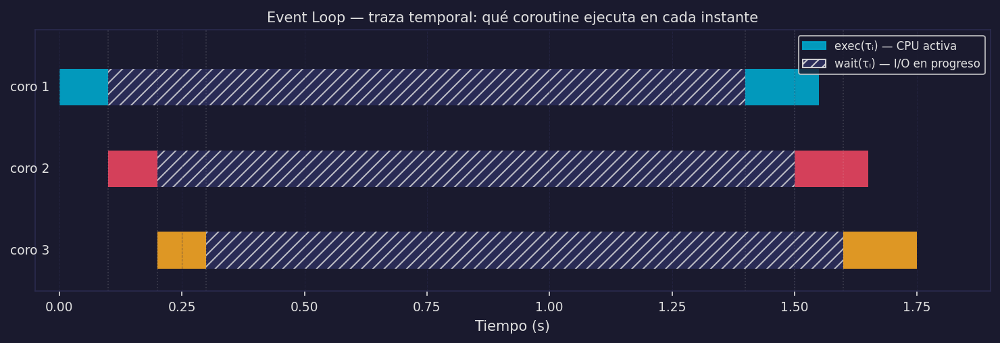

# asyncio — Fundamentos: Event Loop, async/await y gather

Este archivo implementa M4. En `03_concurrencia_y_asincronia.md` definimos el modelo; aquí vemos cómo asyncio lo materializa en Python.

---

## El event loop: implementación de M4

### En la cocina

El event loop es la **lista de pendientes del cocinero**. El cocinero sigue este algoritmo sin parar:

```
Cola de tareas:  [(τ₁, READY), (τ₂, READY), (τ₃, WAITING: horno_timer)]

ciclo:
    tomar siguiente tarea en estado READY de la cola
    trabajar en ella hasta llegar a "poner en el horno" (await)
    registrar callback: "cuando el horno suene, τᵢ vuelve a READY"
    consultar la cola → ¿hay otra tarea READY?
    si sí: trabajarla
    si no: esperar al próximo callback
```

Un solo cocinero (H=1), un solo fogón (P=1). La cocina nunca está ociosa a menos que **todas** las tareas estén en el horno simultáneamente.

### Formalmente

El event loop es el **scheduler de M4**:

```
|ExecutingAt(t)| ≤ 1   para todo t   (single thread — no paralelismo)
∃ i≠j: exec(τⱼ) ∩ wait(τᵢ) ≠ ∅     (esperas explotadas)
```

Cuando una coroutine llega a un `await`, el event loop registra un callback para cuando la operación I/O termine y cede el control a la siguiente coroutine lista. La CPU nunca está idle a menos que todas las coroutines estén en WAITING simultáneamente.

### La traza temporal

Para hacer el event loop visible, imagina 3 usuarios enviando peticiones simultáneamente. Cada petición del chatbot v2 hace:
- exec inicial: ~1ms (parsear la petición)
- wait BD: ~50ms (consultar historial)
- exec: ~2ms (construir prompt)
- wait LLM API: ~1500ms (inferencia remota)
- exec final: ~1ms (formatear respuesta)

```
t=0.000  gather([τ₁, τ₂, τ₃]) — las 3 coroutines quedan READY en la cola

t=0.001  τ₁ exec: parsea petición  →  await consultar_bd  →  τ₁: WAITING(BD)
t=0.002  τ₂ exec: parsea petición  →  await consultar_bd  →  τ₂: WAITING(BD)
t=0.003  τ₃ exec: parsea petición  →  await consultar_bd  →  τ₃: WAITING(BD)
         ↑ Las 3 peticiones están "en vuelo" — la BD atiende las 3 simultáneamente.
           El event loop no tiene nada que ejecutar: espera callbacks de I/O.

t=0.051  τ₁ BD responde  →  τ₁: READY  →  exec: construye prompt  →  await llamar_llm  →  WAITING(LLM)
t=0.052  τ₂ BD responde  →  τ₂: READY  →  exec: construye prompt  →  await llamar_llm  →  WAITING(LLM)
t=0.053  τ₃ BD responde  →  τ₃: READY  →  exec: construye prompt  →  await llamar_llm  →  WAITING(LLM)
         ↑ El LLM API recibe las 3 solicitudes casi al mismo tiempo.

t=1.551  τ₁ LLM responde  →  τ₁: READY  →  exec: formatea  →  DONE ✓
t=1.552  τ₂ LLM responde  →  τ₂: READY  →  exec: formatea  →  DONE ✓
t=1.553  τ₃ LLM responde  →  τ₃: READY  →  exec: formatea  →  DONE ✓

T_total ≈ 1.553s  (vs M2: 3 × 1.554s = 4.662s)
```

Dos observaciones clave:
1. El event loop nunca hace "busy waiting" — entre t=0.003 y t=0.051, el OS monitorea los file descriptors de red y notifica cuando llegan datos.
2. Los tramos exec (1-2ms) de distintas coroutines sí se intercalan en el hilo único, pero son tan cortos que el overhead es negligible frente a los waits (50-1500ms).



> **Verifica en el notebook:** Notebook 02 — Sección 1 mide exactamente esta diferencia con N=5 tareas de 1s. Corre las celdas y compara el tiempo de M2 (await secuencial) con M4 (gather). La traza del event loop con `asyncio` debug mode está en Sección 2.

---

## async def y await

### En la cocina: la receta en papel

Escribe una receta en un papel. El papel existe — tiene todos los pasos escritos — pero la comida no existe todavía. Solo cuando un cocinero toma ese papel y empieza a seguirlo, la receta "ejecuta".

- `async def atender_usuario(...)` = **escribe la receta en papel**. Llamar a la función solo crea el objeto "receta" (coroutine object). La comida no existe todavía.
- `await atender_usuario(42)` = **el cocinero toma la receta y empieza a cocinar**.
- Cada `await` dentro de la receta = **"poner en el horno y avisar"**: el cocinero pone la parte en el horno, le pone un timer, y puede ir a hacer otra cosa. Cuando el timer suena, vuelve y continúa la receta desde donde la dejó.

### En código

```python
async def atender_usuario(user_id):
    historial = await consultar_bd(user_id)
    respuesta = await llamar_llm(historial)
    return respuesta
```

`async def` define una **coroutine** — una receta en papel. Llamar `atender_usuario(42)` **no ejecuta nada**. Solo crea un objeto coroutine. La ejecución ocurre cuando el event loop la toma.

### Formalmente

```python
async def atender_usuario(user_id):
    # ↓ exec(τᵢ): CPU trabaja (parsear petición)
    peticion_parseada = parsear(user_id)

    # ↓ wait(τᵢ) inicia — CPU se libera al event loop
    historial = await consultar_bd(peticion_parseada)
    # ↑ wait(τᵢ) termina — CPU retoma la coroutine desde aquí

    # ↓ exec(τᵢ): CPU trabaja (construir prompt)
    prompt = construir_prompt(historial)

    # ↓ wait(τᵢ) inicia — API del LLM puede tardar 1.5s
    respuesta = await llamar_llm(prompt)
    # ↑ wait(τᵢ) termina

    # ↓ exec(τᵢ): CPU trabaja (formatear resultado)
    return formatear(respuesta)
```

Cada `await` es un punto de **transferencia voluntaria del control** al event loop. Entre `await`s, la coroutine ejecuta sin interrupciones (H=1, sin preemption).

### El error de olvidar el await

```python
# ❌ ERROR COMÚN
async def main():
    resultado = atender_usuario(42)   # solo crea el objeto, no ejecuta nada
    print(resultado)  # imprime <coroutine object atender_usuario at 0x...>
    # Python advierte: RuntimeWarning: coroutine 'atender_usuario' was never awaited

# ✓ CORRECTO
async def main():
    resultado = await atender_usuario(42)   # ejecuta la coroutine
    print(resultado)
```

---

## asyncio.gather — M4 en una línea

### En la cocina

El chef de cocina llega por la mañana con **toda la lista de órdenes del día** y la entrega al cocinero de una vez. El cocinero puede ver todas las órdenes y organizar su trabajo: cuando una va al horno, toma la siguiente de la lista. Si le entregan las órdenes una por una (solo cuando termina la anterior), no puede optimizar nada.

`asyncio.gather` es el chef que entrega todas las órdenes de golpe.

### La diferencia entre M2 y M4

```python
# M2 — await secuencial (chef entrega una orden a la vez)
async def procesar_m2(usuarios):
    for u in usuarios:
        await atender_usuario(u)   # τ_u2 ni existe hasta que τ_u1 termina
# Tiempo total: N × T_usuario

# M4 — asyncio.gather (chef entrega todas las órdenes de una vez)
async def procesar_m4(usuarios):
    await asyncio.gather(
        *[atender_usuario(u) for u in usuarios]
    )
# Tiempo total: ≈ T_usuario  (el más lento del grupo)
```

**Con N=10 usuarios y T_usuario=1.55s:**

| Modelo | Tiempo total | Latencia usuario 10 |
|--------|-------------|---------------------|
| M2 (await secuencial) | 15.5s | 15.5s |
| M4 (gather) | ~1.55s | ~1.55s |

### Formalmente: por qué gather produce M4

`asyncio.gather(*coroutines)` registra **todas** las coroutines en el event loop antes de que ninguna empiece:

```
gather([τ₁, τ₂, τ₃]) — lo que ocurre internamente:

  Fase 1 — registro (microsegundos):
    El event loop recibe τ₁, τ₂, τ₃ y las pone en cola como READY.
    Ninguna ha ejecutado todavía. Ninguna espera todavía.

  Fase 2 — primera ronda de exec (milisegundos):
    El event loop toma τ₁ de la cola → la ejecuta hasta su primer `await`
    → τ₁ pasa a WAITING. La operación I/O de τ₁ ya está en vuelo.
    Lo mismo con τ₂, luego con τ₃.
    Las tres operaciones I/O corren simultáneamente en el OS.

  Fase 3 — espera dirigida por eventos:
    El event loop monitorea los file descriptors (sockets de BD, LLM).
    Cuando cualquier I/O completa, la coroutine correspondiente
    vuelve a READY y el event loop la reanuda desde el punto de `await`.

  Fase 4 — gather completa cuando la ÚLTIMA coroutine retorna.
    El resultado es una lista en el orden de creación, no de finalización.
```

El truco: **todas las tareas se crean antes de que el event loop empiece a esperarlas**. Con `await secuencial`, τ₂ ni siquiera existe hasta que τ₁ termina.

```
gather garantiza:  exec(τⱼ) ∩ wait(τᵢ) ≠ ∅   para i ≠ j   →  M4 ✓
await secuencial:  exec(τⱼ) ∩ wait(τᵢ) = ∅   para i ≠ j   →  M2 ✗
```

---

## time.sleep vs asyncio.sleep

### En la cocina

`time.sleep` = el cocinero se para delante del horno y se **queda dormido**. No solo no hace nada — está físicamente bloqueando el paso para que ningún otro cocinero pueda acercarse al fogón.

`await asyncio.sleep` = el cocinero pone el timer del horno y **va a trabajar en otra orden**. Vuelve cuando suena.

### En código

```python
# ❌ time.sleep — bloquea el event loop entero
async def tarea_mala():
    time.sleep(2)      # la CPU se bloquea 2s — ninguna otra coroutine avanza

# ✓ asyncio.sleep — libera el event loop
async def tarea_buena():
    await asyncio.sleep(2)  # registra callback, cede al event loop
```

```
time.sleep(n):
  → bloquea el hilo del OS
  → exec(τⱼ) ∩ "wait(τᵢ)"_falso = ∅   para todo j ≠ i
  → M4 colapsa a M2 o peor

await asyncio.sleep(n):
  → registra callback "despertar en n segundos"
  → exec(τⱼ) ∩ wait(τᵢ) ≠ ∅  ✓   (M4 funciona)
```

### Regla de oro

```
En una función async: NUNCA uses operaciones bloqueantes sin await.

time.sleep(n)           → await asyncio.sleep(n)
requests.get(url)       → await session.get(url)       (aiohttp, httpx)
open(file).read()       → await aiofiles.open(file)    (aiofiles)
cursor.execute(query)   → await cursor.execute(query)   (asyncpg, aiosqlite)
```

Si la operación no tiene versión async, delégala a un `ThreadPoolExecutor` para no bloquear el event loop.

> **Verifica en el notebook:** Notebook 02 — Sección 2 usa `loop.set_debug(True)` y `loop.slow_callback_duration = 0.05` para detectar automáticamente cuándo una función bloquea el event loop más de 50ms. Corre gather con `asyncio.sleep` y luego con `time.sleep` — la diferencia en el output es inmediata.

---

## Chatbot v2: implementación del Escenario A con asyncio

### Arquitectura

```
          [ Escenario A — LLM como API remota ]

  τ_u1 ──┐
  τ_u2 ──┤──▶ ┌──────────────────────────────────────────────────┐
  τ_u3 ──┘    │  Proceso principal (1 proceso, 1 hilo)           │
              │                                                  │
              │  asyncio.gather(τ_u1, τ_u2, τ_u3, ...)         │
              │                                                  │
              │  Event loop:                                     │
              │  τ_u1 exec ──▶ wait BD ──▶ wait LLM ──▶ exec   │
              │     τ_u2 exec ──▶ wait BD ──▶ wait LLM ──▶ exec │
              │        τ_u3 exec ──▶ wait BD ──▶ wait LLM ──    │
              │                                                  │
              └──────────────────────────────────────────────────┘
                        │                   │
                        ▼                   ▼
                 [ BD (asyncpg) ]   [ LLM API (aiohttp) ]
                   wait ~50ms          wait ~1500ms
```

Durante cada `wait(τ_uᵢ)` (BD o LLM API), el event loop ejecuta `exec(τ_uⱼ)` de otras peticiones. Las 100 peticiones comparten el mismo tiempo de espera en lugar de sumarlo.

### Código

```python
import asyncio

async def consultar_bd(user_id: int) -> list:
    await asyncio.sleep(0.05)   # ~50ms   (wait(τᵢ))
    return [f"mensaje previo de usuario {user_id}"]

async def llamar_llm(historial: list) -> str:
    await asyncio.sleep(1.5)    # ~1500ms (wait(τᵢ))
    return f"respuesta para: {historial[-1]}"

async def handle_request(user_id: int) -> str:
    historial = await consultar_bd(user_id)    # wait — BD
    respuesta = await llamar_llm(historial)    # wait — LLM API
    return f"[u{user_id}] {respuesta}"

async def servidor_v2(n_usuarios: int):
    import time
    t0 = time.perf_counter()
    resultados = await asyncio.gather(
        *[handle_request(i) for i in range(n_usuarios)]
    )
    t_total = time.perf_counter() - t0
    print(f"{n_usuarios} usuarios en {t_total:.2f}s  (esperado: ~1.55s)")
    return resultados
```

Con `gather`, 100 usuarios concurrentes tardan `~1.55s` en lugar de `155s`. El speedup es proporcional a N cuando la tarea es I/O-bound.

---

## ¿Y si el LLM es local?

El chatbot v2 funciona perfectamente para el **Escenario A** — el LLM es una API remota, cada llamada es `wait(τᵢ) ≠ ∅`, y asyncio puede explotar esas esperas.

Pero imaginemos que queremos correr el LLM localmente (llama.cpp, ollama):

```
recv(1ms exec) → read_BD(50ms wait) → inferencia local(2000ms exec) → send(5ms wait)
```

El problema: la inferencia es **CPU-bound** — `wait(τᵢ) = ∅` para ese paso. Si escribimos:

```python
async def handle_request_local(user_id):
    historial = await consultar_bd(user_id)    # wait → event loop libre ✓
    respuesta = inferir_llm_local(historial)   # exec CPU 2s → event loop BLOQUEADO ✗
    await enviar(respuesta)
```

La llamada `inferir_llm_local(historial)` no tiene `await` — es código Python síncrono que bloquea el hilo durante 2 segundos. Durante esos 2 segundos, **ninguna otra coroutine puede avanzar**. M4 colapsa para el paso de inferencia.

Visualmente, con 3 usuarios y LLM local de 2s:

```
Con asyncio puro (LLM local sin await):

t=0.000  gather([τ₁, τ₂, τ₃]) — las 3 empiezan
t=0.003  τ₁, τ₂, τ₃ todas WAITING(BD)
t=0.053  τ₁ BD lista → exec → inferir_llm_local() → BLOQUEA EL HILO 2s
         τ₂ y τ₃ están READY pero no pueden ejecutar — el hilo está ocupado
t=2.053  τ₁ termina inferencia → exec → DONE
         τ₂ resume → exec → inferir_llm_local() → BLOQUEA EL HILO 2s
         τ₃ sigue esperando
t=4.053  τ₂ DONE, τ₃ resume → inferencia → BLOQUEA 2s
t=6.053  τ₃ DONE

T_total ≈ 6s  (3 × 2s de inferencia en serie)
Prometíamos M4: T_total ≈ 2s. Lo que tenemos es M1 para el paso de inferencia.
```

La solución — `loop.run_in_executor(ProcessPoolExecutor)` — es exactamente lo que hace el chatbot v3 (M5b).

Necesitamos un modelo diferente: uno que pueda ejecutar la inferencia CPU-bound en procesos paralelos mientras el event loop sigue atendiendo I/O.

**Eso es el Escenario B — M5b — chatbot v3. Lo vemos en `05_paralelismo.md`.**

---

:::exercise{title="Predecir tiempos de gather"}
Dadas estas coroutines:

```python
async def tarea_a(): await asyncio.sleep(1.0); return "A"
async def tarea_b(): await asyncio.sleep(2.0); return "B"
async def tarea_c(): await asyncio.sleep(0.5); return "C"
```

Predice el tiempo total para:
1. `await tarea_a(); await tarea_b(); await tarea_c()` — ¿qué modelo (M2 o M4)?
2. `await asyncio.gather(tarea_a(), tarea_b(), tarea_c())` — ¿qué modelo?

¿Qué tarea determina el tiempo de gather? ¿Por qué?

**Bonus:** Si `tarea_b` usa `time.sleep(2.0)` en lugar de `await asyncio.sleep(2.0)`, ¿cambia el resultado de `gather`? ¿Por qué?
:::
