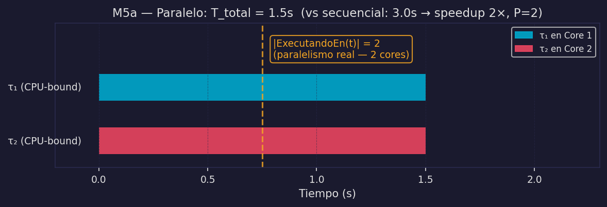
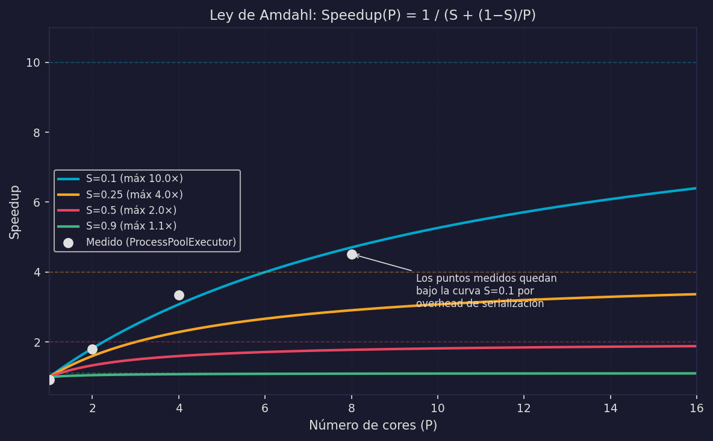
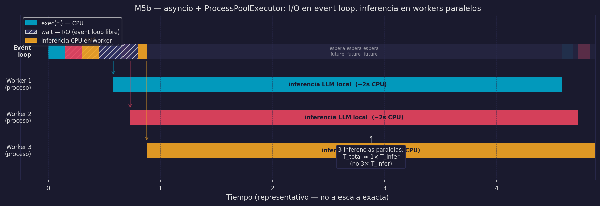

# Paralelismo — M5, Ley de Amdahl y Chatbot v3

Los modelos M1–M4 operan con P=1 (un core activo o un hilo). El paralelismo requiere P≥2: múltiples cores ejecutan instrucciones **físicamente al mismo tiempo**. Este es un salto cualitativo, no solo cuantitativo.

---

## Modelo 5 — Paralelo (M5)

### En la cocina

Dos estaciones de trabajo independientes, cada una con su propio fogón, su propia despensa y su propio cocinero. Mientras el cocinero de la estación A prepara un risotto, el cocinero de la estación B prepara un filete. No comparten fogón, no se turnan — trabajan literalmente al mismo tiempo.

Esto requiere dos fogones (P=2). Un solo fogón no puede usarse dos veces al mismo tiempo.

### En lenguaje natural

Paralelismo es ejecución física simultánea en múltiples cores. No es time-slicing (turnarse en un core) sino instantes de tiempo donde múltiples tareas tienen la CPU asignada en cores distintos.

### Formalmente

```
M5 — Paralelo:
∃ τᵢ, τⱼ ∈ Task, i ≠ j, ∃ t ∈ T:
    t ∈ exec(τᵢ)  ∧  t ∈ exec(τⱼ)

Requiere: P ≥ 2  (al menos dos cores físicos)
```

Hay un instante t en que la CPU ejecuta simultáneamente dos tareas distintas en cores distintos.

### Diagrama de Gantt



El diagrama muestra el momento clave: en t=T_exec/2, ambas tareas están ejecutando en paralelo. `|ExecutingAt(t)| = 2`.

### Prueba: Paralelo ⊃ Concurrente

Todo sistema paralelo es concurrente, pero no viceversa.

```
Demostración:
Sea t ∈ exec(τᵢ) ∩ exec(τⱼ)  (existe por definición de paralelismo)

→ t ∈ [start(τᵢ), end(τᵢ)]    (t está dentro del ciclo de vida de τᵢ)
→ t ∈ [start(τⱼ), end(τⱼ)]    (ídem para τⱼ)
→ [start(τᵢ), end(τᵢ)] ∩ [start(τⱼ), end(τⱼ)] ∋ t ≠ ∅

∴ Paralelo → Concurrente  ✓
```

El recíproco no vale: concurrencia (solapamiento de ciclos de vida) puede ocurrir con P=1 por time-slicing (M3) o por event loop (M4).

### Jerarquía de modelos

```
Distribuido ⊇ Paralelo ⊇ Concurrente

Distribuido: múltiples máquinas, Mem(nᵢ) ∩ Mem(nⱼ) = ∅, latencia δᵢⱼ > 0
Paralelo:    P ≥ 2, ∃ t: |ExecutingAt(t)| = 2
Concurrente: solapamiento de ciclos de vida, P puede ser 1

Asíncrono: ortogonal — puede combinarse con cualquier nivel
           M4 = Concurrente+Async,  M5b = Paralelo+Async
```

---

## Ley de Amdahl — el límite del paralelismo

### En la cocina

Imagina que preparar un plato tiene dos partes: la mise en place (cortar, pesar — paralelizable con más cocineros) y el emplatado final (solo el chef lo hace — no paralelizable). Si el emplatado toma el 30% del tiempo, aunque tengas 1000 cocineros en la mise en place, el plato nunca puede completarse en menos del 30% del tiempo original. El cuello de botella secuencial domina.

### En lenguaje natural

El speedup de agregar más cores está limitado por la fracción de trabajo que **no puede paralelizarse** — código de inicialización, comunicación entre procesos, escritura final de resultados. Esta fracción secuencial pone un techo duro al speedup posible.

### Derivación formal

Sea:
```
T   = tiempo total secuencial
S   = fracción secuencial inevitable (0 ≤ S ≤ 1)
1-S = fracción paralelizable
P   = número de cores disponibles
```

Con P cores:
```
T_secuencial = S · T          (no mejora con más cores)
T_paralelo   = (1-S) · T / P  (se divide entre P cores)

T(P) = S·T + (1-S)·T/P  =  T · (S + (1-S)/P)

Speedup(P) = T / T(P) = 1 / (S + (1-S)/P)

lim_{P→∞} Speedup(P) = 1/S
```

**El techo teórico de speedup es 1/S — determinado solo por la fracción secuencial.**

### Tabla de límites

| S (fracción secuencial) | Speedup máximo teórico | Speedup con P=4 | Speedup con P=8 |
|------------------------|----------------------|-----------------|-----------------|
| 10% | 10× | 3.1× | 4.7× |
| 25% | 4× | 2.3× | 2.9× |
| 50% | 2× | 1.6× | 1.8× |
| 90% | 1.1× | 1.07× | 1.08× |

Con S=50%, aunque tengas 1000 cores el máximo speedup es 2×.

### Diagrama de Amdahl



Los puntos medidos están por debajo de la curva teórica porque el overhead de serialización (pickle/unpickle) y creación de procesos forma parte de la fracción secuencial efectiva — invisible en el código pero presente en el tiempo real.

---

## M5a y M5b — dos variantes del paralelismo

### M5a: Paralelo puro, CPU-bound

**En la cocina:** tres cocineros CPU-bound (sin horno, sin esperas) procesando fragmentos independientes de la misma tarea. Cada uno tiene su propio cuchillo (su propio proceso Python con su propio GIL).

**En lenguaje natural:** tareas CPU-bound independientes en procesos separados. Escapa el GIL porque cada proceso tiene su propio intérprete Python.

**Formalmente:**
```
M5a:
∃ t: exec(τᵢ) ∩ exec(τⱼ) ≠ ∅  (paralelismo)
∀ τᵢ: wait(τᵢ) = ∅             (todas CPU-bound)
```

**Pseudocódigo:**
```python
from concurrent.futures import ProcessPoolExecutor
import os

def calcular_fragmento(datos: list) -> float:
    """CPU-bound: wait(τᵢ) = ∅"""
    return sum(x**2 for x in datos)

with ProcessPoolExecutor(max_workers=os.cpu_count()) as executor:
    fragmentos = [datos[i::n_workers] for i in range(n_workers)]
    resultados = list(executor.map(calcular_fragmento, fragmentos))
```

**Cuándo usar:** procesamiento de datos, transformaciones numéricas, cifrado por bloques — tareas CPU-bound sin I/O.

### M5b: Paralelo + async (el patrón del Escenario B)

**En la cocina:** la cocina tiene una sección de fogones (para trabajo de cuchillo — CPU) y una sección de hornos (para esperas — I/O). El chef ejecutivo coordina: cuando llega un pedido, la parte de mise en place la hace el cocinero de fogones; cuando necesita el horno, lo delega a la sección de hornos y el cocinero de fogones puede tomar el siguiente pedido.

**En lenguaje natural:** el event loop asyncio maneja las partes I/O de cada petición. Cuando necesita ejecutar inferencia CPU-bound, la delega a un `ProcessPoolExecutor`. Desde el punto de vista del event loop, esta delegación es un `wait(τᵢ)` — la CPU del proceso principal queda libre para otras peticiones.

**Formalmente:**
```
M5b:
∃ t: exec(τᵢ_cpu) ∩ exec(τⱼ_cpu) ≠ ∅   (paralelismo CPU en workers)
∃ τₖ: wait(τₖ) ≠ ∅                       (I/O gestionado por asyncio)
```

**Diagrama:**



---

## Chatbot v3: Escenario B con M5b

### En la cocina

El chatbot v3 tiene dos tipos de trabajo:
- **I/O-bound** (recv, leer BD, send) → event loop asyncio, 1 hilo
- **CPU-bound** (inferencia LLM local) → ProcessPoolExecutor, P cores

El event loop actúa como el chef ejecutivo: recibe pedidos, hace las consultas I/O de forma concurrente, y delega la inferencia a los workers. Los workers procesan inferencias en paralelo.

### Arquitectura

```
          [ Escenario B — LLM local ]

  τ_u1 ──┐
  τ_u2 ──┤──▶ ┌──────────────────────────────────────────┐
  τ_u3 ──┘    │  Proceso principal (event loop asyncio)  │
              │                                          │
              │  τ_u1: recv ──▶ wait BD ──▶ [inferencia] │
              │  τ_u2:   recv ──▶ wait BD ──▶ [inferencia]│
              │  τ_u3:     recv ──▶ wait BD ──▶ [infer.] │
              │                                          │
              └──────────┬───────────────────────────────┘
                         │  run_in_executor (datos serializados via IPC)
            ┌────────────┼────────────┐
            ▼            ▼            ▼
       ┌─────────┐ ┌─────────┐ ┌─────────┐
       │Worker 1 │ │Worker 2 │ │Worker 3 │
       │proceso  │ │proceso  │ │proceso  │
       │infer LLM│ │infer LLM│ │infer LLM│  ← P procesos en P cores
       └─────────┘ └─────────┘ └─────────┘
       (ProcessPoolExecutor — P workers ≈ os.cpu_count())

  Durante inferencia de τ_uᵢ en Worker 1:
  → El event loop sigue libre para recv(τ_u4), BD(τ_u5), etc.
  → Workers 2, 3 procesan inferencias de τ_u2, τ_u3 en paralelo
```

### Código

```python
import asyncio
from concurrent.futures import ProcessPoolExecutor
import os

# CPU-bound: debe estar en módulo de nivel superior (para pickle)
def inferir_llm_local(historial: list) -> str:
    """wait(τᵢ) = ∅ — inferencia CPU-bound del modelo local"""
    # En producción: model.generate(historial)
    resultado = sum(range(5_000_000))   # simula carga computacional
    return f"respuesta_local para {historial[-1]}"

# Pool pre-creado: evitar overhead de creación en cada petición
_executor = ProcessPoolExecutor(max_workers=os.cpu_count())

async def consultar_bd(user_id: int) -> list:
    await asyncio.sleep(0.05)   # wait(τᵢ) — I/O BD
    return [f"historial de {user_id}"]

async def handle_request_v3(user_id: int) -> str:
    # wait(τᵢ): I/O a BD — event loop libre para otras peticiones
    historial = await consultar_bd(user_id)

    # wait(τᵢ) efectivo: inferencia en proceso separado
    # El event loop ve esto como cualquier otro wait — sigue libre
    loop = asyncio.get_event_loop()
    respuesta = await loop.run_in_executor(_executor, inferir_llm_local, historial)

    return f"[u{user_id}] {respuesta}"

async def servidor_v3(n_usuarios: int):
    import time
    t0 = time.perf_counter()
    resultados = await asyncio.gather(
        *[handle_request_v3(i) for i in range(n_usuarios)]
    )
    t_total = time.perf_counter() - t0
    print(f"v3: {n_usuarios} usuarios en {t_total:.2f}s")
    return resultados
```

### Por qué funciona M5b

```
Para petición τ_uᵢ:
  wait(τᵢ): BD → event loop gestiona (concurrencia M4)
  wait(τᵢ): run_in_executor → event loop libre para otras peticiones (M4)

Simultáneamente en los workers:
  exec(τ_u1_cpu) en Core 1
  exec(τ_u2_cpu) en Core 2    ← paralelismo real (M5)
  exec(τ_u3_cpu) en Core 3

T_total ≈ T_bd + T_inferencia  (no N × T_inferencia)
```

Con P=4 workers y Amdahl S≈0.05 (inicialización + serialización):
```
Speedup(4) = 1 / (0.05 + 0.95/4) ≈ 3.4×
```

---

## Cuándo usar cada modelo

```
¿La tarea es I/O-bound?   → asyncio (M4)
                               wait(τᵢ) ≠ ∅ → event loop explota las esperas

¿La tarea es CPU-bound?   → ProcessPoolExecutor (M5a)
                               escapa el GIL con procesos separados

¿Tienes ambas?            → asyncio + ProcessPoolExecutor (M5b)
                               cada nivel resuelve su problema
                               chatbot Escenario B → M5b
```

---

:::exercise{title="Calcular con Amdahl"}
Un chatbot Escenario B con inferencia local tarda en promedio:
- 1ms de recv+parse (exec)
- 50ms de BD (wait)
- 2000ms de inferencia LLM (exec, CPU-bound)
- 5ms de send (wait)
- ~5ms de overhead IPC serialización (exec)

1. Calcula S (fracción no paralelizable) y el speedup máximo teórico.
2. Con P=4 cores, ¿cuánto speedup esperas para la inferencia?
3. ¿Cuántos cores son necesarios para alcanzar el 80% del speedup máximo?
4. ¿Cómo afecta a S si el overhead de IPC crece a 50ms (por historial largo)?
:::
