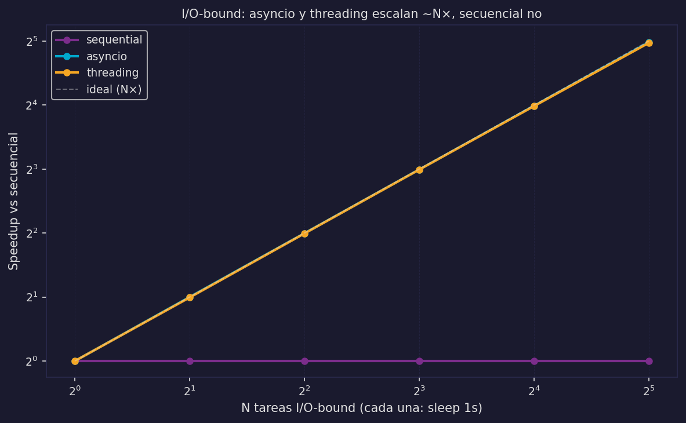
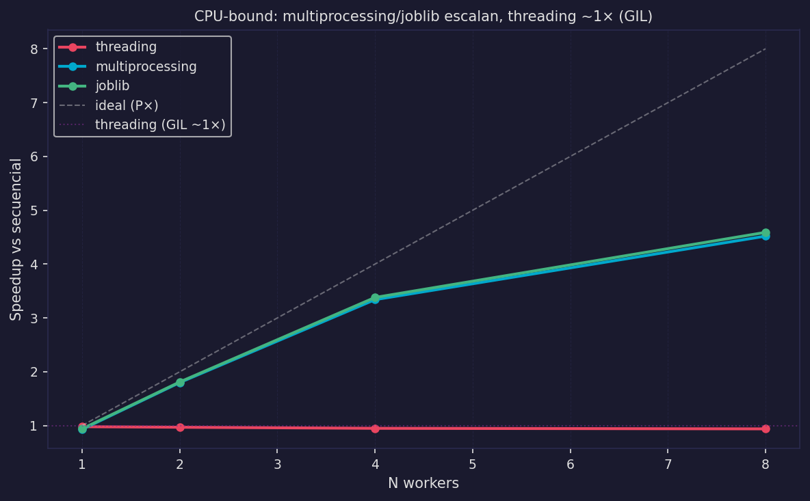
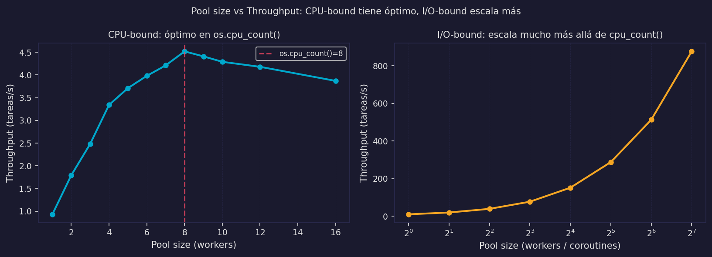

# Librerías Python y Árbol de Decisión

Los modelos M1–M5 ahora son concretos. Este archivo mapea cada modelo a las librerías Python que lo implementan y ofrece un árbol de decisión para elegir la herramienta correcta en práctica.

---

## El Pool — concepto base

### En la cocina: la brigada de guardia

En una cocina de alto volumen, los cocineros no se contratan y despiden por pedido — eso sería imposiblemente costoso. En cambio, hay una **brigada de guardia**: un número fijo de cocineros que esperan junto al ticket rail. Cuando llega un pedido, el primer cocinero disponible lo toma. Cuando termina, vuelve a esperar.

Esto es un **pool**: trabajadores pre-creados, compartidos, listos para tomar trabajo de una cola.

### Formalmente

```
Pool = (Workers, Q)

Workers = {θ₁, θ₂, ..., θₙ}   workers pre-creados (hilos o procesos)
Q                               cola FIFO de tareas pendientes
```

Los workers se crean **una sola vez** al inicializar el pool. Cuando llega una tarea, se encola. El primer worker libre la toma.

### Pool vs creación por tarea

```python
# ❌ Anti-patrón: crear proceso por cada tarea
for item in dataset:                     # 10,000 items
    p = multiprocessing.Process(...)     # overhead de creación × 10,000
    p.start(); p.join()
# Costo: O(N) × 50–200ms = inaceptable

# ✓ Correcto: pool (creación amortizada)
with ProcessPoolExecutor(max_workers=4) as pool:
    resultados = list(pool.map(fn, dataset))
# Costo creación: O(1) × 4 workers — amortizado en todas las tareas
```

---

## Tabla de librerías Python

| Librería | Modelo | Tipo de tarea | Cuándo usar | Cuándo NO usar |
|----------|--------|--------------|-------------|----------------|
| `threading.Thread` | M3 | I/O-bound | Control fino de un hilo, pocos hilos | CPU-bound (GIL), muchas tareas |
| `ThreadPoolExecutor` | M3+pool | I/O-bound | Muchas tareas I/O con pool, API síncrona | CPU-bound (GIL no escapa) |
| `asyncio` | M4 | I/O-bound | Máxima concurrencia I/O, librerías async | CPU-bound sin run_in_executor |
| `multiprocessing.Process` | M5a | CPU-bound | Control fino de un proceso, pocos procesos | Muchas tareas (crear N procesos es costoso) |
| `ProcessPoolExecutor` | M5a+pool | CPU-bound | Muchas tareas CPU-bound, integra con asyncio | Funciones no-picklable (lambdas) |
| `joblib.Parallel` | M5a+pool | CPU-bound | Scikit-learn ecosystem, arrays numpy | Integración con asyncio |

### threading vs asyncio para I/O-bound

```
asyncio:  más eficiente, menor overhead — pero requiere librerías async (aiohttp, asyncpg)
threading: más simple, funciona con librerías síncronas — pero escala peor (N hilos = N stacks)
```

### joblib

```python
from joblib import Parallel, delayed

resultados = Parallel(n_jobs=4)(
    delayed(procesar)(item) for item in dataset
)
```

`joblib` usa `loky` como backend por defecto (más robusto que `multiprocessing` para notebooks). Backends `threading` y `multiprocessing` intercambiables con un parámetro.

---

## Árbol de decisión

```
¿Cuál librería usar?
│
├─ ¿La tarea es I/O-bound? (wait(τᵢ) ≠ ∅)
│  │
│  │  [Chatbot Escenario A: LLM como API remota → I/O-bound]
│  │
│  ├─ ¿Hay librerías async disponibles? (aiohttp, asyncpg, aiofiles...)
│  │  └─ SÍ → asyncio + asyncio.gather / create_task        [M4]  ← Escenario A
│  │
│  └─ ¿Solo librerías síncronas? (requests, psycopg2...)
│     ├─ ¿Pocas tareas (<10)?   → threading.Thread           [M3]
│     └─ ¿Muchas tareas (≥10)?  → ThreadPoolExecutor         [M3+pool]
│
├─ ¿La tarea es CPU-bound? (wait(τᵢ) = ∅)
│  │
│  │  [Chatbot Escenario B: LLM local, inferencia CPU → CPU-bound]
│  │
│  ├─ ¿Usa NumPy/extensiones C que liberan el GIL?
│  │  └─ SÍ → ThreadPoolExecutor puede funcionar             [M3]
│  │
│  ├─ ¿Python puro?
│  │  ├─ ¿Pocas tareas (<10)?   → multiprocessing.Process    [M5a]
│  │  ├─ ¿Muchas tareas (≥10)?  → ProcessPoolExecutor        [M5a+pool]
│  │  └─ ¿Scikit-learn / numpy? → joblib.Parallel            [M5a+pool]
│  │
│  └─ ¿Carga mixta (I/O + CPU)?
│     │
│     │  [Chatbot Escenario B: recv/BD = I/O + inferencia = CPU]
│     │
│     └─ asyncio + loop.run_in_executor(ProcessPoolExecutor) [M5b]  ← Escenario B
│
└─ ¿Distribuido? (múltiples máquinas)
   └─ ver 07_distribuido_intro.md                            [M6]
```

### Chatbot: qué cambia entre Escenario A y B

| Componente | Escenario A | Escenario B |
|---|---|---|
| recv + parse | asyncio (exec, instantáneo) | asyncio (exec, instantáneo) |
| leer BD | asyncio (wait I/O) | asyncio (wait I/O) |
| LLM | asyncio (wait I/O — API remota) | `run_in_executor` → ProcessPool (exec CPU-bound) |
| send | asyncio (wait I/O) | asyncio (wait I/O) |
| **Modelo** | **M4** | **M5b** |

---

## Anti-patrones cross-cutting

### 1. Lambda en ProcessPoolExecutor (PicklingError)

```python
# ❌ Anti-patrón
with ProcessPoolExecutor() as pool:
    resultados = list(pool.map(lambda x: x**2, datos))
# → PicklingError: Can't pickle <function <lambda> at ...>

# ✓ Fix 1: función definida a nivel de módulo
def al_cuadrado(x):
    return x**2

with ProcessPoolExecutor() as pool:
    resultados = list(pool.map(al_cuadrado, datos))

# ✓ Fix 2: functools.partial para parámetros extra
from functools import partial

def potencia(x, n):
    return x**n

al_cubo = partial(potencia, n=3)
with ProcessPoolExecutor() as pool:
    resultados = list(pool.map(al_cubo, datos))
```

### 2. Pool creado por petición

```python
# ❌ Anti-patrón — chatbot Escenario B
async def handle_request(peticion):
    with ProcessPoolExecutor(max_workers=4) as pool:  # nuevo pool por petición
        resultado = await loop.run_in_executor(pool, calcular, peticion)
# Con 100 req/s: 400 procesos creados/destruidos por segundo

# ✓ Correcto: pool compartido a nivel de aplicación
_POOL = ProcessPoolExecutor(max_workers=os.cpu_count())

async def handle_request(peticion):
    loop = asyncio.get_event_loop()
    resultado = await loop.run_in_executor(_POOL, calcular, peticion)
```

### 3. Código bloqueante en async sin run_in_executor

```python
# ❌ Anti-patrón
async def handler():
    datos = open("archivo.csv").read()     # bloqueante → congela event loop
    resultado = requests.get(url)          # bloqueante → congela event loop

# ✓ Correcto
async def handler():
    loop = asyncio.get_event_loop()
    datos = await loop.run_in_executor(None, leer_archivo, "archivo.csv")
    async with aiohttp.ClientSession() as session:
        async with session.get(url) as response:
            resultado = await response.json()
```

### 4. Más workers que cores para CPU-bound

```python
# ❌ Anti-patrón (thrashing)
with ProcessPoolExecutor(max_workers=100) as pool:  # máquina tiene 8 cores
    resultados = list(pool.map(tarea_cpu_bound, datos))
# 100 procesos compiten por 8 cores → overhead domina el trabajo útil

# ✓ Correcto
with ProcessPoolExecutor(max_workers=os.cpu_count()) as pool:
    resultados = list(pool.map(tarea_cpu_bound, datos))
```

Para I/O-bound, más workers que cores puede ser útil (los workers esperan I/O, no compiten por CPU). Para CPU-bound, `max_workers = os.cpu_count()` es el óptimo.

### 5. Falta de `if __name__ == "__main__"` en scripts

```python
# ❌ En scripts .py (no en notebooks)
from concurrent.futures import ProcessPoolExecutor

pool = ProcessPoolExecutor(max_workers=4)
resultados = list(pool.map(mi_funcion, datos))
# En Windows/macOS: cada worker importa el módulo → recursión infinita

# ✓ Correcto en scripts
if __name__ == "__main__":
    pool = ProcessPoolExecutor(max_workers=4)
    resultados = list(pool.map(mi_funcion, datos))
```

En notebooks este problema no ocurre. En scripts `.py` es obligatorio.

---

## Benchmarks comparativos

### I/O-bound: asyncio vs ThreadPoolExecutor vs secuencial



Tanto asyncio como ThreadPoolExecutor producen speedup ~N para N tareas I/O-bound. asyncio tiene menor overhead por tarea porque no crea hilos del OS — relevante para el Escenario A con muchos usuarios concurrentes.

### CPU-bound: ProcessPoolExecutor vs threading vs secuencial



- `threading`: speedup ≈ 1 (o menor, por overhead del GIL) — confirma por qué threading no sirve para el Escenario B
- `ProcessPoolExecutor`: speedup ≈ P (limitado por Amdahl con S del overhead de serialización)

### Pool size vs throughput



El punto de inflexión para CPU-bound ocurre en `max_workers = os.cpu_count()`. Para I/O-bound, el óptimo depende de la latencia del dispositivo externo y puede estar mucho más alto.

---

:::exercise{title="Elegir la herramienta correcta"}
Para cada escenario, elige la librería apropiada y justifica usando el árbol de decisión:

1. Descargar 500 imágenes de URLs distintas (sin librería async disponible)
2. Calcular PCA sobre una matriz 50,000×1,000 con scikit-learn
3. Un servidor de chatbot con LLM de Anthropic API (Escenario A)
4. Un servidor de chatbot con LLM local llama.cpp (Escenario B)
5. Procesar 1,000 archivos de audio con librería C pura que libera el GIL
:::
