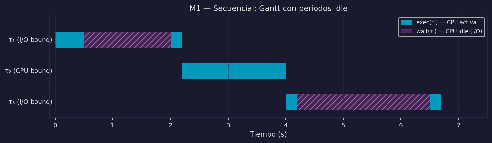

# El Framework Matemático y el Modelo Secuencial

Este archivo define el **framework matemático completo** que usaremos en todo el módulo. Los objetos definidos aquí — T, τᵢ, exec, wait, ExecutingAt, P — aparecerán en todos los modelos siguientes sin redefinirse.

---

## Framework matemático: definiciones base

### Tiempo

```
T = ℝ⁺ ∪ {0}    conjunto de todos los instantes de tiempo
```

*En la cocina:* la línea de tiempo del día de trabajo en el restaurante.

### Tarea

```
Task = {τ₁, τ₂, ..., τₙ}    conjunto de tareas a ejecutar
τᵢ ∈ Task                    una tarea individual
```

*En la cocina:* el conjunto de tickets de órdenes que hay que procesar.

Cada tarea tiene límites temporales:
```
start(τᵢ) ∈ T    instante en que la tarea comienza
end(τᵢ) ∈ T      instante en que la tarea termina
start(τᵢ) ≤ end(τᵢ)
```

*El ciclo de vida de una tarea:* `[start(τᵢ), end(τᵢ)]` — el intervalo desde que se recibe la orden hasta que se entrega.

### Ejecución CPU

```
exec(τᵢ) ⊆ T    conjunto de instantes en que la CPU ejecuta τᵢ
```

*En la cocina:* los momentos en que el cocinero trabaja activamente en esta orden (corta, mezcla, emplata).

### Espera I/O

```
wait(τᵢ) ⊆ T    conjunto de instantes en que τᵢ espera un dispositivo externo
```

*En la cocina:* los momentos en que la orden está en el horno, cafetera o timer — el cocinero no necesita estar presente.

### Restricción fundamental

```
exec(τᵢ) ∩ wait(τᵢ) = ∅
```

Una tarea no puede estar ejecutando en la CPU **y** esperando I/O al mismo tiempo. O el cocinero trabaja activamente o la orden está en el horno — no ambas simultáneamente.

Esta restricción vale para **todos** los modelos.

### Enlace con I/O-bound / CPU-bound

Como se anticipó en `01_procesos_y_hilos.md`:
```
CPU-bound  ≡  wait(τᵢ) = ∅     toda la tarea es exec(τᵢ), nunca espera I/O
I/O-bound  ≡  wait(τᵢ) ≠ ∅     la tarea tiene al menos un instante de espera
```

### Tareas ejecutando en t

```
ExecutingAt(t) = {τᵢ ∈ Task | t ∈ exec(τᵢ)}
```

El conjunto de tareas que tienen asignada la CPU en el instante t.

*En la cocina:* qué órdenes está procesando activamente el cocinero en este momento.

### Cores físicos

```
P = número de cores físicos disponibles
```

Restricción hard de la máquina:
```
|ExecutingAt(t)| ≤ P    para todo t ∈ T
```

No pueden ejecutarse simultáneamente más tareas que cores físicos.

---

## Modelo 1: Secuencial

### Definición formal

```
M1 — Secuencial:
∀ τᵢ, τⱼ ∈ Task, i ≠ j:
    end(τᵢ) ≤ start(τⱼ)  ∨  end(τⱼ) ≤ start(τᵢ)
```

Los ciclos de vida de cualquier par de tareas no se solapan. Hay un orden total: primero τ₁ de principio a fin, luego τ₂, luego τ₃...

*En la cocina:* el cocinero toma una orden, la procesa completamente de principio a fin, y **solo entonces** toma la siguiente. No hay nada en el horno mientras trabaja en la siguiente orden.

### Propiedades del modelo secuencial

```
|ExecutingAt(t)| ≤ 1    siempre hay a lo mucho una tarea en CPU
exec(τⱼ) ∩ wait(τᵢ) = ∅    para todo i ≠ j (esperas no explotadas)
T_total = Σᵢ (end(τᵢ) - start(τᵢ))    tiempo total es la suma
```

La segunda propiedad es la limitación crítica: **si τᵢ tiene wait(τᵢ) ≠ ∅, la CPU queda ociosa durante esos instantes**. Nadie más la usa.

### Diagrama de Gantt

Tres tareas: τ₁ (I/O-bound), τ₂ (CPU-bound), τ₃ (I/O-bound)

```
Tiempo →  0    1    2    3    4    5    6    7    8    9   10

τ₁:       [exec░░░░░░░exec]
τ₂:                         [exec exec exec exec]
τ₃:                                              [exec░░░░░exec]
CPU:      [████░░░░░░████] [████████████████] [████░░░░░████]

████ = ejecución CPU activa   ░░░ = CPU ociosa (wait de I/O)
```

La CPU está ociosa durante los waits de τ₁ y τ₃. Nadie más puede usar esos ciclos.



### Pseudocódigo

```python
for τᵢ in tareas:
    resultado = procesar(τᵢ)   # bloqueante: espera hasta terminar
    guardar(resultado)
# τᵢ₊₁ no empieza hasta que τᵢ termina completamente
```

---

## Chatbot v1: servidor secuencial

**En la analogía:** la estación de cocina toma el primer pedido, lo procesa de principio a fin, y solo entonces toma el siguiente. Si hay 10 clientes esperando, el décimo no recibe atención hasta que los 9 anteriores hayan sido atendidos completamente.

**Formalmente:**

```
Task = {τ_u1, τ_u2, ..., τ_u10}   (10 peticiones de usuarios)
end(τ_u1) ≤ start(τ_u2) ≤ end(τ_u2) ≤ start(τ_u3) ...

Si cada petición tarda 2s:
    Latencia(τ_u1)  = 2s
    Latencia(τ_u2)  = 4s   (espera τ_u1 + 2s)
    Latencia(τ_u10) = 20s  ← inaceptable
    T_total = 20s
```

**Pseudocódigo:**

```python
# Servidor chatbot v1 — secuencial
def servidor():
    while True:
        peticion = esperar_peticion()   # wait(τᵢ) — I/O
        historial = leer_bd(peticion)   # wait(τᵢ) — I/O
        respuesta = llamar_llm(historial) # wait(τᵢ) — I/O (API externa)
        enviar(respuesta)               # wait(τᵢ) — I/O
        # La siguiente petición no se toma hasta aquí
```

Durante cada `leer_bd()` y `llamar_llm()`, la CPU está completamente ociosa. El servidor está bloqueado esperando, sin poder atender a nadie más.

**El problema en números:** si `llamar_llm()` tarda 1.5s (típico), el servidor pasa el 75% del tiempo ociosa esperando la API. Con 10 usuarios simultáneos, el último espera 20s en lugar de 2s.

Este es el costo del modelo secuencial. Los modelos siguientes lo resuelven de diferentes maneras.

---

:::exercise{title="Análisis del modelo secuencial"}
Dado un servidor con τ = {τ₁, τ₂, τ₃} donde:
- τ₁: exec = [0, 0.5], wait = [0.5, 2.0], exec = [2.0, 2.2]
- τ₂: exec = [2.2, 3.0] (CPU-bound, sin wait)
- τ₃: exec = [3.0, 3.2], wait = [3.2, 5.5], exec = [5.5, 5.7]

Calcula: T_total, el porcentaje de tiempo que la CPU está ociosa, y Latencia(τ₃).
:::
