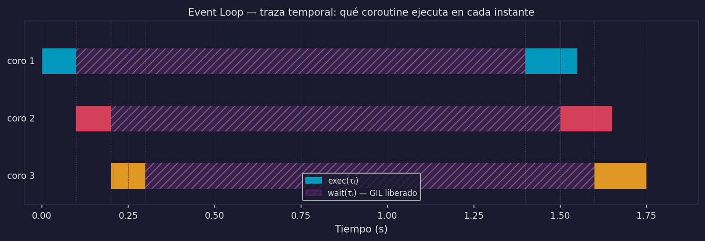

# asyncio — Fundamentos: Event Loop, async/await y gather

Este archivo implementa M4. En `03_concurrencia_y_asincronia.md` definimos el modelo; aquí vemos cómo asyncio lo materializa en Python.

---

## El event loop: implementación de M4

### En la analogía

El event loop es la **lista de pendientes del cocinero**:

```
Q = [(τᵢ, estado), ...]   cola de tareas y su estado actual

Estados posibles:
  READY   — lista para ejecutar (tiene CPU work por hacer)
  WAITING — esperando dispositivo externo (timer activo)
```

El ciclo del cocinero:

```
loop:
    tarea = Q.siguiente_en_READY()
    ejecutar(tarea)  hasta encontrar un await (entrada al horno)
    registrar_callback(tarea, cuando_horno_termine)
    → repetir con la siguiente tarea READY
    → cuando el callback dispara: marcar τᵢ como READY otra vez
```

### Formalmente

El event loop es el **scheduler de M4**: selecciona la siguiente coroutine lista para ejecutar y garantiza:

```
|ExecutingAt(t)| ≤ 1   para todo t   (single thread — no paralelismo)
∃ i≠j: exec(τⱼ) ∩ wait(τᵢ) ≠ ∅     (esperas explotadas)
```

Cuando una coroutine llega a un `await`, el event loop registra un callback para cuando la operación termine y cede el control a la siguiente coroutine lista. La CPU nunca está idle a menos que **todas** las coroutines estén en WAITING simultáneamente.

### La traza temporal



La traza muestra cómo el event loop salta entre coroutines en los puntos de `await` — los momentos en que exec(τᵢ) se pausa y exec(τⱼ) comienza.

---

## async def y await

### `async def` — la receta en papel

```python
async def atender_usuario(user_id):
    historial = await consultar_bd(user_id)
    respuesta = await llamar_llm(historial)
    return respuesta
```

`async def` define una **coroutine** — una receta en papel. Llamar `atender_usuario(42)` **no ejecuta nada**. Solo crea un objeto coroutine. La ejecución ocurre cuando el event loop la toma.

### Mapeo exec(τᵢ) / wait(τᵢ) al código

```python
async def atender_usuario(user_id):
    # ↓ exec(τᵢ): CPU trabaja
    peticion_parseada = parsear(user_id)

    # ↓ wait(τᵢ): inicia — CPU se libera, event loop atiende otras
    historial = await consultar_bd(peticion_parseada)
    # ↑ wait(τᵢ): termina — CPU retoma desde aquí

    # ↓ exec(τᵢ): CPU trabaja nuevamente
    prompt = construir_prompt(historial)

    # ↓ wait(τᵢ): inicia — API del LLM puede tardar 1.5s
    respuesta = await llamar_llm(prompt)
    # ↑ wait(τᵢ): termina

    # ↓ exec(τᵢ): CPU trabaja
    return formatear(respuesta)
```

Cada `await` es un punto de **transferencia voluntaria del control** al event loop. Entre `await`s, la coroutine ejecuta sin interrupciones (recuerda: H=1, sin preemption).

### El error de no-await

```python
# ❌ ERROR COMÚN
async def main():
    resultado = atender_usuario(42)   # solo crea el objeto, no ejecuta nada
    print(resultado)                  # imprime <coroutine object atender_usuario at 0x...>
    # Python advierte: "RuntimeWarning: coroutine 'atender_usuario' was never awaited"

# ✓ CORRECTO
async def main():
    resultado = await atender_usuario(42)   # ejecuta la coroutine
    print(resultado)
```

`await` es obligatorio para ejecutar una coroutine. Sin él, el objeto existe en memoria pero nunca corre.

---

## asyncio.gather — M4 en una línea

### La diferencia entre M2 y M4

La diferencia entre código secuencial (M2) y concurrente (M4) en asyncio es una sola función:

```python
# M2 — await secuencial (esperas NO explotadas)
async def procesar_m2(usuarios):
    for u in usuarios:
        await atender_usuario(u)   # τ_u1 completa antes de crear τ_u2
# Tiempo total: N × T_usuario

# M4 — asyncio.gather (esperas SÍ explotadas)
async def procesar_m4(usuarios):
    await asyncio.gather(
        *[atender_usuario(u) for u in usuarios]
    )
# Tiempo total: ≈ T_usuario  (el más lento del grupo)
```

**Con N=10 usuarios y T_usuario=2s:**

| Modelo | Tiempo total | Latencia usuario 10 |
|--------|-------------|---------------------|
| M2 (await secuencial) | 20s | 20s |
| M4 (gather) | ~2s | ~2s |

### Por qué gather produce M4

`asyncio.gather(*coroutines)` registra **todas** las coroutines en el event loop antes de que ninguna empiece. El event loop las gestiona concurrentemente: cuando τ₁ entra en `await` (wait), el event loop corre τ₂, τ₃, etc.

```
gather([τ₁, τ₂, τ₃]):
  t=0: registra τ₁, τ₂, τ₃ en Q (todas READY)
  t=0: ejecuta τ₁ hasta su primer await → τ₁ pasa a WAITING
  t=0⁺: ejecuta τ₂ hasta su primer await → τ₂ pasa a WAITING
  t=0⁺⁺: ejecuta τ₃ hasta su primer await → τ₃ pasa a WAITING
  t=1.5: τ₁ termina su wait → READY → ejecuta hasta siguiente await o return
  ...
```

El truco es que **todas las tareas se crean antes de que el event loop empiece a esperarlas**. Con `await secuencial`, τ₂ ni siquiera existe hasta que τ₁ termina.

---

## time.sleep vs asyncio.sleep

Este es el anti-patrón más común y más peligroso en código asyncio.

### time.sleep bloquea el event loop

```python
import time
import asyncio

async def tarea_mala():
    print("empezando")
    time.sleep(2)      # ← BLOQUEA el event loop entero durante 2s
    print("terminando")

async def otra_tarea():
    await asyncio.sleep(0.1)
    print("soy otra tarea")  # ← NUNCA corre mientras tarea_mala duerme

# Con gather: otra_tarea NO puede avanzar durante el time.sleep
```

`time.sleep(n)` es operación **sincrónica** — bloquea el hilo del OS. Desde la perspectiva del event loop, convierte `wait(τᵢ)` en `exec(τᵢ)`: la CPU no está disponible para nadie más.

```
Consecuencia:
  exec(τⱼ) ∩ wait(τᵢ)_falso = ∅   para todo j ≠ i
  → M4 colapsa a M2 o peor
```

### asyncio.sleep libera el event loop

```python
async def tarea_buena():
    print("empezando")
    await asyncio.sleep(2)  # ← registra callback, libera event loop
    print("terminando")

# Durante el await asyncio.sleep:
# → event loop puede ejecutar otras coroutines
# → exec(τⱼ) ∩ wait(τᵢ) ≠ ∅  ✓  (M4 funciona)
```

`await asyncio.sleep(n)` registra un callback "despertar en n segundos" y devuelve el control al event loop. Esto es exactamente `wait(τᵢ)` — la CPU se usa para otras cosas.

### Regla de oro

```
En una función async: NUNCA uses operaciones bloqueantes sin await.

time.sleep(n)           → await asyncio.sleep(n)
requests.get(url)       → await session.get(url)      (aiohttp, httpx)
open(file).read()       → await aiofiles.open(file)   (aiofiles)
cursor.execute(query)   → await cursor.execute(query)  (asyncpg, aiosqlite)
```

Si la operación no tiene versión async, delégala a un ThreadPoolExecutor para no bloquear el event loop.

---

## Chatbot v2: implementación con asyncio

El problema del chatbot v1 era M1: latencia = N × T. La solución es M4.

```python
import asyncio

# Simula las operaciones reales (I/O-bound)
async def consultar_bd(user_id: int) -> list:
    await asyncio.sleep(0.05)   # ~50ms   (wait(τᵢ))
    return [f"mensaje previo de usuario {user_id}"]

async def llamar_llm(historial: list) -> str:
    await asyncio.sleep(1.5)    # ~1500ms (wait(τᵢ))
    return f"respuesta para historial: {historial[-1]}"

async def handle_request(user_id: int) -> str:
    # exec(τᵢ): parsear petición
    peticion = f"peticion_usuario_{user_id}"

    # wait(τᵢ): I/O a BD
    historial = await consultar_bd(user_id)

    # wait(τᵢ): I/O a API externa
    respuesta = await llamar_llm(historial)

    # exec(τᵢ): formatear respuesta
    return f"[u{user_id}] {respuesta}"

async def servidor_v2(n_usuarios: int):
    import time
    t0 = time.perf_counter()

    # M4: todas las peticiones concurrentes
    resultados = await asyncio.gather(
        *[handle_request(i) for i in range(n_usuarios)]
    )

    t_total = time.perf_counter() - t0
    print(f"{n_usuarios} usuarios en {t_total:.2f}s  (esperado: ~1.55s)")
    return resultados

# asyncio.run(servidor_v2(100))
```

Con `gather`, 100 usuarios concurrentes tardan `~1.55s` (0.05 + 1.5 de la tarea más lenta) en lugar de `155s` (100 × 1.55s del modelo secuencial).

**Limitación:** si alguna petición requiriera inferencia local del LLM (CPU-bound), esa coroutine bloquearía el event loop durante toda la inferencia. La solución — `ProcessPoolExecutor` + asyncio — es el chatbot v3 en `05_paralelismo.md`.

---

:::exercise{title="Predecir tiempos de gather"}
Dadas las siguientes coroutines:

```python
async def tarea_a(): await asyncio.sleep(1.0); return "A"
async def tarea_b(): await asyncio.sleep(2.0); return "B"
async def tarea_c(): await asyncio.sleep(0.5); return "C"
```

Predice el tiempo total para:
1. `await tarea_a(); await tarea_b(); await tarea_c()` (await secuencial)
2. `await asyncio.gather(tarea_a(), tarea_b(), tarea_c())` (gather)

Justifica con las definiciones de M2 y M4. ¿Qué tarea determina el tiempo de gather?
:::
