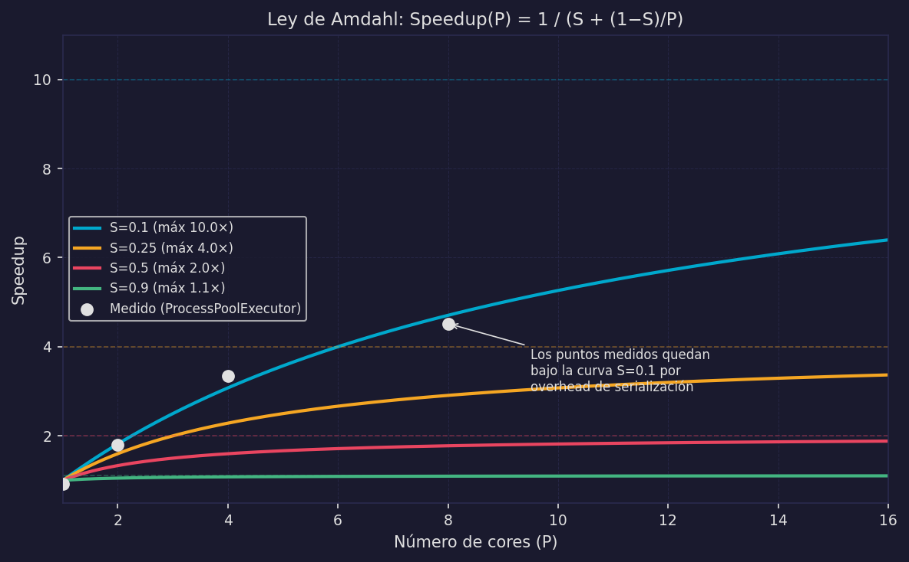

# Paralelismo — M5, Ley de Amdahl y Chatbot v3

Los modelos M1–M4 operan con P=1 (un core activo o un hilo). El paralelismo requiere P≥2: múltiples cores ejecutan instrucciones **físicamente al mismo tiempo**. Este es un salto cualitativo, no solo cuantitativo.

---

## Modelo 5 — Paralelo (M5)

### Definición formal

```
M5 — Paralelo:
∃ τᵢ, τⱼ ∈ Task, i ≠ j, ∃ t ∈ T:
    t ∈ exec(τᵢ)  ∧  t ∈ exec(τⱼ)

Requiere: P ≥ 2  (al menos dos cores físicos)
```

Hay un instante t en que la CPU ejecuta simultáneamente dos tareas distintas. No es time-slicing — es ejecución física simultánea en cores distintos.

*En la cocina:* dos estaciones de trabajo independientes, cada una con su propio fogón, su propia despensa y su propio cocinero. Procesan órdenes distintas al mismo tiempo.

### Prueba: Paralelo ⊃ Concurrente

Todo sistema paralelo es concurrente, pero no viceversa.

```
Demostración:
Sea t ∈ exec(τᵢ) ∩ exec(τⱼ)  (existe por definición de paralelismo)

→ t ∈ [start(τᵢ), end(τᵢ)]    (t es instante de ejecución, dentro del ciclo de vida)
→ t ∈ [start(τⱼ), end(τⱼ)]    (ídem para τⱼ)
→ [start(τᵢ), end(τᵢ)] ∩ [start(τⱼ), end(τⱼ)] ∋ t ≠ ∅

∴ Paralelo → Concurrente  ✓
```

Intuitivamente: si dos cosas ocurren al mismo tiempo, sus intervalos de tiempo obviamente solapan. El recíproco no vale: concurrencia (solapamiento de ciclos de vida) puede ocurrir con P=1 por time-slicing.

### Jerarquía de modelos

```
Distribuido ⊇ Paralelo ⊇ Concurrente

Distribuido: múltiples máquinas, Mem(nᵢ) ∩ Mem(nⱼ) = ∅, δᵢⱼ > 0
Paralelo:    P ≥ 2, |ExecutingAt(t)| puede ser 2
Concurrente: solapamiento de ciclos de vida, P puede ser 1

Asíncrono: ortogonal — independiente de la jerarquía de paralelismo
           puede combinarse con cualquier nivel (M4 = Concurrente+Async, M5b = Paralelo+Async)
```

### Diagrama de Gantt — M5 con P=2

```
Tiempo →  0    1    2    3    4    5    6    7

Core 1:   [████ τ₁ ████░░░░░░████]
Core 2:   [████ τ₂ ████████████████]

t ∈ [0,3]: |ExecutingAt(t)| = 2   ← paralelismo real
           τ₁ y τ₂ ejecutan físicamente al mismo tiempo

████ = ejecución CPU   ░░░ = CPU idle (wait de I/O de τ₁)
```

---

## Ley de Amdahl — el límite del paralelismo

El paralelismo acelera la ejecución, pero no infinitamente. La Ley de Amdahl cuantifica el límite.

### Derivación desde primeros principios

Sea:

```
T   = tiempo total de la tarea si fuera ejecutada secuencialmente
S   = fracción secuencial inevitable (0 ≤ S ≤ 1)
      (código que no puede paralelizarse: serialización, inicialización, etc.)
1-S = fracción paralelizable
P   = número de cores disponibles
```

Descomposición del tiempo con P cores:

```
T_secuencial = S · T          (esta parte no mejora con más cores)
T_paralelo   = (1-S) · T / P  (esta parte se divide entre P cores)

T(P) = T_secuencial + T_paralelo
T(P) = S·T + (1-S)·T/P
T(P) = T · (S + (1-S)/P)
```

Speedup:

```
Speedup(P) = T / T(P) = T / [T · (S + (1-S)/P)]

Speedup(P) = 1 / (S + (1-S)/P)
```

Límite cuando P → ∞:

```
lim_{P→∞} Speedup(P) = lim_{P→∞} 1 / (S + (1-S)/P)
                      = 1 / (S + 0)
                      = 1 / S
```

**El techo teórico de speedup es 1/S — determinado solo por la fracción secuencial.**

### Tabla de límites

| S (fracción secuencial) | Speedup máximo teórico | Speedup con P=4 | Speedup con P=8 |
|------------------------|----------------------|-----------------|-----------------|
| 10% | 10× | 3.1× | 4.7× |
| 25% | 4× | 2.3× | 2.9× |
| 50% | 2× | 1.6× | 1.8× |
| 90% | 1.1× | 1.07× | 1.08× |

Con S=50%, aunque tengas 1000 cores el máximo speedup es 2×. La fracción secuencial domina el rendimiento.

### Curvas de Amdahl y datos medidos



Los puntos medidos (benchmark con `sum(range(N))` × K repeticiones usando `ProcessPoolExecutor`) están típicamente **por debajo** de la curva teórica debido a:

```
Overhead real = overhead_creación_procesos + overhead_serialización + overhead_scheduling
```

Si los datos medidos se alejan de la curva de S=0.1, la fracción secuencial efectiva es mayor que la esperada. Esto indica que el overhead de gestión de procesos forma parte de la "fracción secuencial" no visible en el código.

**Para el chatbot v3:** si la serialización de la respuesta y el overhead de `ProcessPoolExecutor` toman el 20% del tiempo total (S=0.20), el máximo speedup teórico es 1/0.20 = 5×. Agregar el décimo core no produciría mejora apreciable.

---

## M5a y M5b — dos variantes del paralelismo

### M5a: Parallel puro, CPU-bound

```
M5a:
∃ t: exec(τᵢ) ∩ exec(τⱼ) ≠ ∅  (paralelismo)
∀ τᵢ: wait(τᵢ) = ∅             (todas CPU-bound, sin I/O)
```

Tareas CPU-bound independientes en múltiples procesos. Escapa el GIL creando procesos separados (cada uno con su propio intérprete Python).

```python
from concurrent.futures import ProcessPoolExecutor
import os

def calcular_fragmento(datos: list) -> float:
    """CPU-bound pura: wait(τᵢ) = ∅"""
    return sum(x**2 for x in datos)

def procesar_paralelo(datos_grandes: list) -> float:
    n_workers = os.cpu_count()
    fragmentos = [datos_grandes[i::n_workers] for i in range(n_workers)]

    with ProcessPoolExecutor(max_workers=n_workers) as executor:
        resultados = list(executor.map(calcular_fragmento, fragmentos))
    return sum(resultados)
```

**Cuándo usar M5a:** tareas CPU-bound que no tienen I/O, como procesamiento de datos, transformaciones numéricas, cifrado por bloques.

### M5b: Parallel + async — el patrón del chatbot v3

```
M5b:
∃ t: exec(τᵢ) ∩ exec(τⱼ) ≠ ∅  (paralelismo entre procesos)
∃ τₖ: wait(τₖ) ≠ ∅             (hay I/O — gestionado por asyncio dentro de cada proceso)
```

El servidor asyncio (M4) maneja las peticiones I/O-bound. Cuando necesita hacer trabajo CPU-bound (inferencia local del LLM), lo delega a un `ProcessPoolExecutor`. Lo mejor de ambos mundos.

### Chatbot v3: asyncio + ProcessPoolExecutor

```python
import asyncio
from concurrent.futures import ProcessPoolExecutor
import os

# --- Función CPU-bound: debe estar en módulo de nivel superior para pickle ---
def inferir_llm_local(historial: list) -> str:
    """CPU-bound: inferencia del modelo local. wait(τᵢ) = ∅"""
    # En producción: modelo.generate(historial)
    resultado = sum(range(5_000_000))   # simula carga computacional
    return f"respuesta_local para {historial[-1]}"

# --- Servidor M5b ---
_executor = ProcessPoolExecutor(max_workers=os.cpu_count())

async def consultar_bd(user_id: int) -> list:
    """I/O-bound: wait(τᵢ) ≠ ∅"""
    await asyncio.sleep(0.05)
    return [f"historial de {user_id}"]

async def handle_request_v3(user_id: int) -> str:
    """M5b: I/O gestionado por asyncio, CPU delegado a ProcessPoolExecutor"""
    # wait(τᵢ): I/O a BD — event loop libre
    historial = await consultar_bd(user_id)

    # wait(τᵢ) efectivo: inferencia CPU-bound en proceso separado
    # El event loop sigue libre para otras peticiones durante esta espera
    loop = asyncio.get_event_loop()
    respuesta = await loop.run_in_executor(_executor, inferir_llm_local, historial)

    return f"[u{user_id}] {respuesta}"

async def servidor_v3(n_usuarios: int):
    import time
    t0 = time.perf_counter()
    resultados = await asyncio.gather(
        *[handle_request_v3(i) for i in range(n_usuarios)]
    )
    t_total = time.perf_counter() - t0
    print(f"v3: {n_usuarios} usuarios en {t_total:.2f}s")
    return resultados

# if __name__ == '__main__':
#     asyncio.run(servidor_v3(10))
```

**Por qué funciona M5b:**

```
Petición de usuario (I/O-bound):
  wait(τᵢ): BD, API → asyncio event loop gestiona, P=1
  wait(τᵢ): inferencia CPU → ProcessPoolExecutor, P=N_cores

El event loop ve run_in_executor como un wait(τᵢ) más:
  exec(τⱼ) ∩ wait_run_in_executor(τᵢ) ≠ ∅  ← concurrencia entre peticiones

Simultáneamente, los procesos del executor ejecutan:
  exec(τᵢ_cpu) en Core 1, exec(τₖ_cpu) en Core 2  ← paralelismo real
```

---

## Cuándo usar multiprocessing vs asyncio

```
¿La tarea es I/O-bound?   → asyncio (M4)
                               wait(τᵢ) ≠ ∅ → event loop explota las esperas

¿La tarea es CPU-bound?   → multiprocessing / ProcessPoolExecutor (M5a)
                               escapa el GIL con procesos separados

¿Tienes ambas?            → M5b: asyncio + ProcessPoolExecutor
                               cada nivel resuelve su problema
```

---

:::exercise{title="Calcular con Amdahl"}
Un programa tarda 100s secuencialmente. El profiling muestra:
- 30s de lectura de archivos (I/O-bound, no paralelizable con cores)
- 70s de procesamiento numérico (CPU-bound, paralelizable)

1. Calcula S y el speedup máximo teórico.
2. ¿Cuántos cores necesitas para alcanzar el 80% del speedup máximo?
3. Si agregas asyncio para el I/O, ¿cambia S? ¿Cómo afecta el speedup total?
:::
