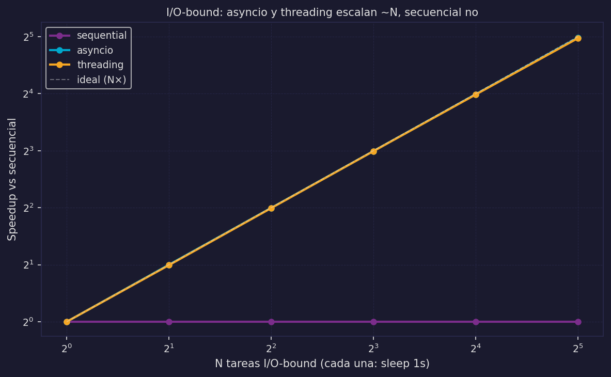
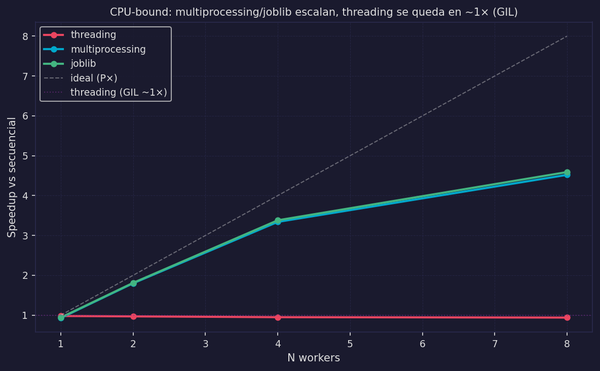
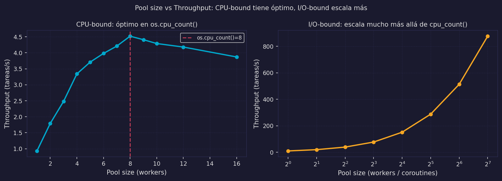

# Librerías Python y Árbol de Decisión

Los modelos M1–M5 ahora son concretos. Este archivo mapea cada modelo a las librerías Python que lo implementan y ofrece un árbol de decisión para elegir la herramienta correcta en práctica.

---

## El Pool — concepto base

Antes de revisar librerías, necesitamos el concepto de **pool**, que la mayoría usa internamente.

### Definición formal

```
Pool = (Workers, Q)

Workers = {θ₁, θ₂, ..., θₙ}   conjunto de workers pre-creados (hilos o procesos)
Q                               cola FIFO de tareas pendientes
```

Los workers se crean **una sola vez** al inicializar el pool. Cuando llega una tarea, se encola en Q. El primer worker libre la toma.

*En la cocina:* una brigada de cocineros de guardia junto al ticket rail. No se contratan ni despiden por pedido — están siempre listos. El chef jefe simplemente pone tickets en el rail.

### Pool vs creación por tarea

```python
# ❌ Anti-patrón: crear proceso nuevo por cada tarea
for item in dataset:                     # 10,000 items
    p = multiprocessing.Process(...)     # overhead de creación × 10,000
    p.start()
    p.join()
# Costo: O(N) × overhead_creación_proceso ≈ O(N) × 50–200ms = inaceptable

# ✓ Correcto: pool de procesos (creación amortizada)
with ProcessPoolExecutor(max_workers=4) as pool:
    resultados = list(pool.map(fn, dataset))
# Costo creación: O(1) × overhead_creación × 4 workers — amortizado en N tareas
```

---

## Tabla de librerías Python

| Librería | Modelo | Tipo de tarea | Cuándo usar | Cuándo NO usar |
|----------|--------|--------------|-------------|----------------|
| `threading.Thread` | M3 | I/O-bound | Control fino de un hilo específico, pocos hilos | CPU-bound (GIL), muchas tareas (crea N hilos) |
| `concurrent.futures.ThreadPoolExecutor` | M3+pool | I/O-bound | Muchas tareas I/O con pool, API síncrona | CPU-bound (GIL no escapa), librerías async disponibles |
| `asyncio` | M4 | I/O-bound | Máxima concurrencia I/O, single thread, librerías async | CPU-bound sin run_in_executor, librerías solo síncronas |
| `multiprocessing.Process` | M5a | CPU-bound | Control fino de un proceso específico, pocos procesos | Muchas tareas (crea N procesos), carga I/O-bound |
| `concurrent.futures.ProcessPoolExecutor` | M5a+pool | CPU-bound | Muchas tareas CPU-bound, integra bien con asyncio | Funciones no-picklable (lambdas), I/O-bound (overhead excesivo) |
| `joblib.Parallel` | M5a+pool | CPU-bound | Scikit-learn ecosystem, backends intercambiables, copiado eficiente de arrays numpy | Cuando se necesita integración con asyncio |

### Notas sobre la tabla

**threading vs asyncio para I/O-bound:**

```
asyncio: más eficiente, menor overhead, pero requiere librerías async (aiohttp, asyncpg)
threading: más simple, funciona con librerías síncronas, pero escala peor (N hilos = N stacks)
```

**joblib:**

```python
from joblib import Parallel, delayed

# Interfaz funcional — más limpia que ProcessPoolExecutor.map para algunos casos
resultados = Parallel(n_jobs=4)(
    delayed(procesar)(item) for item in dataset
)
```

`joblib` usa `loky` como backend por defecto (más robusto que `multiprocessing` para notebooks). También tiene backends `threading` y `multiprocessing` intercambiables con un parámetro.

---

## Árbol de decisión

```
¿Cuál librería usar?
│
├─ ¿La tarea es I/O-bound? (wait(τᵢ) ≠ ∅)
│  │
│  ├─ ¿Hay librerías async disponibles? (aiohttp, asyncpg, aiofiles...)
│  │  └─ SÍ → asyncio + asyncio.gather / create_task        [M4]
│  │
│  └─ ¿Solo librerías síncronas? (requests, psycopg2...)
│     ├─ ¿Pocas tareas (<10)?   → threading.Thread           [M3]
│     └─ ¿Muchas tareas (≥10)?  → ThreadPoolExecutor         [M3+pool]
│
├─ ¿La tarea es CPU-bound? (wait(τᵢ) = ∅)
│  │
│  ├─ ¿Usa NumPy/extensiones C que liberan el GIL?
│  │  └─ SÍ → ThreadPoolExecutor puede funcionar             [M3]
│  │
│  ├─ ¿Python puro?
│  │  ├─ ¿Pocas tareas (<10)?   → multiprocessing.Process    [M5a]
│  │  ├─ ¿Muchas tareas (≥10)?  → ProcessPoolExecutor        [M5a+pool]
│  │  └─ ¿Scikit-learn / arrays numpy? → joblib.Parallel     [M5a+pool]
│  │
│  └─ ¿Carga mixta (I/O + CPU)?
│     └─ asyncio + loop.run_in_executor(ProcessPoolExecutor) [M5b]
│
└─ ¿Distribuido? (múltiples máquinas)
   └─ ver 07_distribuido_intro.md                            [M6]
```

---

## Anti-patrones cross-cutting

### 1. Lambda en ProcessPoolExecutor (PicklingError)

```python
# ❌ Anti-patrón
with ProcessPoolExecutor() as pool:
    resultados = list(pool.map(lambda x: x**2, datos))
# → PicklingError: Can't pickle <function <lambda> at ...>
# Las lambdas no tienen nombre — no pueden serializarse entre procesos
```

```python
# ✓ Fix 1: función definida a nivel de módulo
def al_cuadrado(x):
    return x**2

with ProcessPoolExecutor() as pool:
    resultados = list(pool.map(al_cuadrado, datos))

# ✓ Fix 2: functools.partial para funciones con parámetros extra
from functools import partial

def potencia(x, n):
    return x**n

al_cubo = partial(potencia, n=3)
with ProcessPoolExecutor() as pool:
    resultados = list(pool.map(al_cubo, datos))
```

### 2. Pool creado por petición en lugar de por aplicación

```python
# ❌ Anti-patrón
async def handle_request(peticion):
    with ProcessPoolExecutor(max_workers=4) as pool:  # nuevo pool por petición
        resultado = await loop.run_in_executor(pool, calcular, peticion)
# Overhead: crear 4 procesos × cada petición
# Con 100 req/s: 400 procesos creados/destruidos por segundo

# ✓ Correcto: pool compartido a nivel de aplicación
_POOL = ProcessPoolExecutor(max_workers=os.cpu_count())

async def handle_request(peticion):
    loop = asyncio.get_event_loop()
    resultado = await loop.run_in_executor(_POOL, calcular, peticion)
    return resultado
# Pool creado una vez, reused para todas las peticiones
```

### 3. Código bloqueante en async sin run_in_executor

```python
# ❌ Anti-patrón
async def handler():
    datos = open("archivo_grande.csv").read()   # bloqueante — congela event loop
    resultado = requests.get(url)               # bloqueante — congela event loop

# ✓ Correcto: delegar al executor
async def handler():
    loop = asyncio.get_event_loop()
    datos = await loop.run_in_executor(None, leer_archivo, "archivo_grande.csv")
    async with aiohttp.ClientSession() as session:
        async with session.get(url) as response:
            resultado = await response.json()
```

### 4. Más workers que cores para CPU-bound (thrashing)

```python
# ❌ Anti-patrón
with ProcessPoolExecutor(max_workers=100) as pool:  # máquina tiene 8 cores
    # 100 procesos compiten por 8 cores
    # overhead de context switch domina el trabajo útil
    resultados = list(pool.map(tarea_cpu_bound, datos))

# ✓ Correcto: max_workers = os.cpu_count()
with ProcessPoolExecutor(max_workers=os.cpu_count()) as pool:
    resultados = list(pool.map(tarea_cpu_bound, datos))
```

Para I/O-bound, más workers que cores puede tener sentido (los workers esperan I/O, no compiten por CPU). Para CPU-bound, `max_workers = os.cpu_count()` o ligeramente menos para dejar capacidad al OS.

### 5. Falta de `if __name__ == "__main__"` en scripts

```python
# ❌ Anti-patrón en scripts .py (no en notebooks)
from concurrent.futures import ProcessPoolExecutor

pool = ProcessPoolExecutor(max_workers=4)
resultados = list(pool.map(mi_funcion, datos))
# En Windows/macOS (spawn mode): cada worker importa el módulo
# → el módulo se ejecuta de nuevo → crea otro pool → recursión infinita

# ✓ Correcto en scripts
if __name__ == "__main__":
    pool = ProcessPoolExecutor(max_workers=4)
    resultados = list(pool.map(mi_funcion, datos))
```

En notebooks este problema no ocurre (el módulo no se re-importa). En scripts `.py` es obligatorio.

---

## Benchmarks comparativos

### I/O-bound: asyncio vs ThreadPoolExecutor vs secuencial



Los datos muestran que tanto asyncio como ThreadPoolExecutor producen speedup ~N para N tareas I/O-bound (hasta el límite de saturación del sistema I/O). asyncio tiene menor overhead por tarea porque no crea hilos del OS.

### CPU-bound: ProcessPoolExecutor vs threading vs secuencial



Los datos confirman la predicción del GIL:
- `threading`: speedup ≈ 1 (o menor, por overhead del GIL)
- `ProcessPoolExecutor`: speedup ≈ P (limitado por Amdahl con S del overhead de serialización)

### Pool size vs throughput



El punto de inflexión del throughput ocurre en `max_workers = os.cpu_count()` para tareas CPU-bound. Más allá, el thrashing reduce el rendimiento. Para I/O-bound, el punto óptimo depende de la latencia del dispositivo externo.

---

:::exercise{title="Elegir la herramienta correcta"}
Para cada escenario, elige la librería apropiada y justifica usando el árbol de decisión:

1. Descargar 500 imágenes de URLs distintas (sin librería async disponible)
2. Calcular PCA sobre una matriz 50,000×1,000 con scikit-learn
3. Un servidor web que hace consultas a PostgreSQL por cada request
4. Procesar 1,000 archivos de audio (conversión de formato con librería C pura)
5. Un script que hace web scraping síncronico con BeautifulSoup + requests
:::
